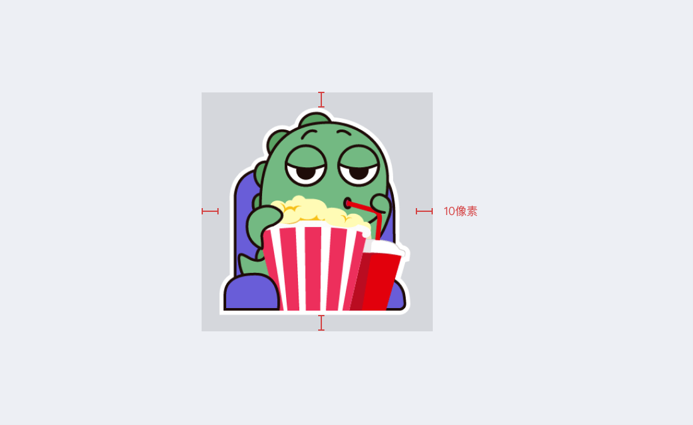

# Sticker

Artists can submit sticker works to Mixin Messenger.

### Requirements

- Work copyright: the submitter must own the copyright of the work。
- Sticker size: minimum 256 pixels, maximum 512 pixels, 512 x 512 pixels recommended。
- Number of stickers: 9 sheets, 12 sheets, 15 sheets, 18 sheets, 21 sheets, 24 sheets, 27 sheets, 30 sheets。
- Sticker format: png, jpg, gif, Lottie, WebP, Animated WebP.
- Sticker banner: aspect ratio 16:10, recommended 960 x 600 pixels.
- Label icon: 96 x 96 pixels recommended.
- File size: minimum 1 kb, maximum 800kb.
- Naming convention: The sticker file must be named with numbers, such as "01.happy.png", "02.exciting.png", "30.sobbing.png"; the banner file name must be "banner.png"; the thumb must be "thumb.png".
- manifest.json file, which contains the name, locale and description of the album.
- Only `is_verified` album will be list sticker album store, you can contact 7000, if you want to list in album store., if you want to list in album store., if you want to list in album store., if you want to list in album store.

Content of the manifest.json

```
{
  "name": "piggy", // Not blank，max 64
  "locale": "zh", // und，en or zh
  "description": "piggy is lovely", // Optional，max 256
}
```

## Directory structure of ZIP file

- 01.happy.png
- 02.exciting.png
- ...
- 30.sobbing.png
- banner.png
- manifest.json
- thumb.png

### Creation Guide

- Stickers Padding

  

### Submitting sticker

Name the stickers, label icons, and banner images according to the requirements, and then compress them together with the copyright file ([download template](http://www.mixinbots.com/docs/sticker-copyright-notice.doc)) into a zip or 7z format. Send to Mixin Messenger 1039549.
