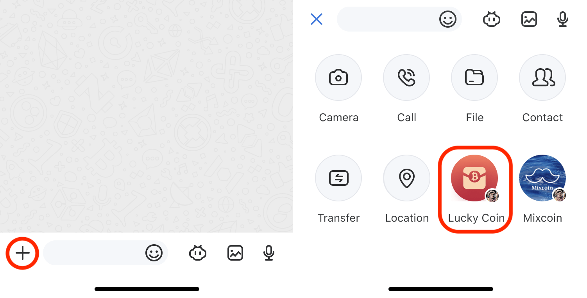
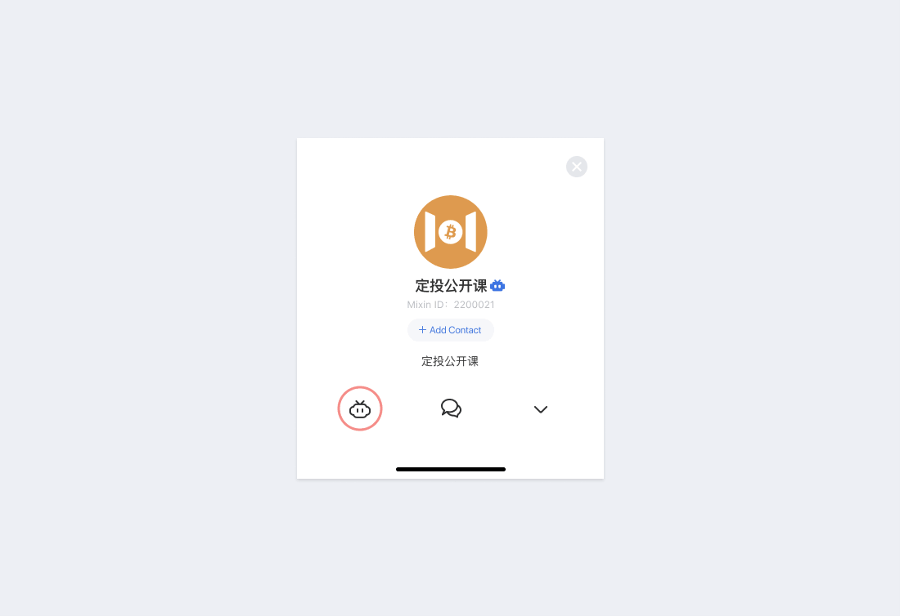
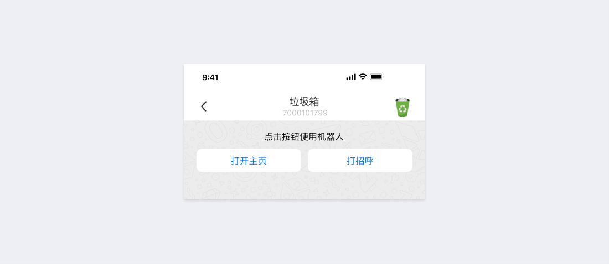
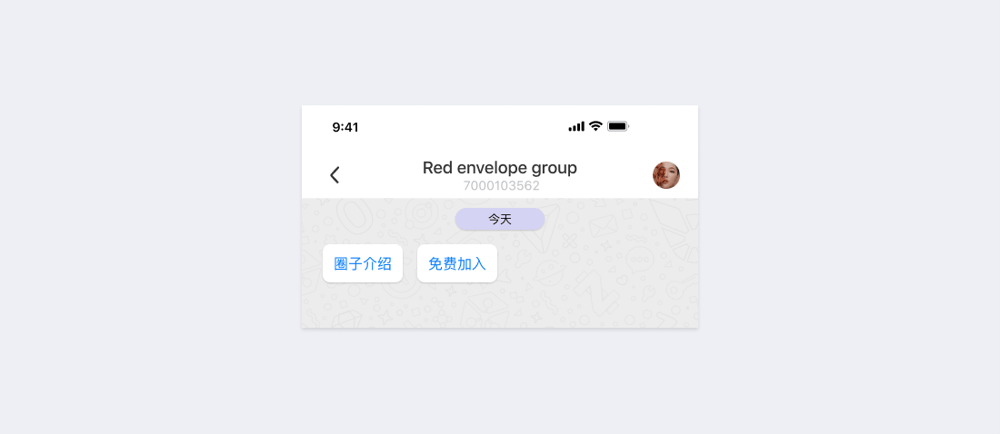
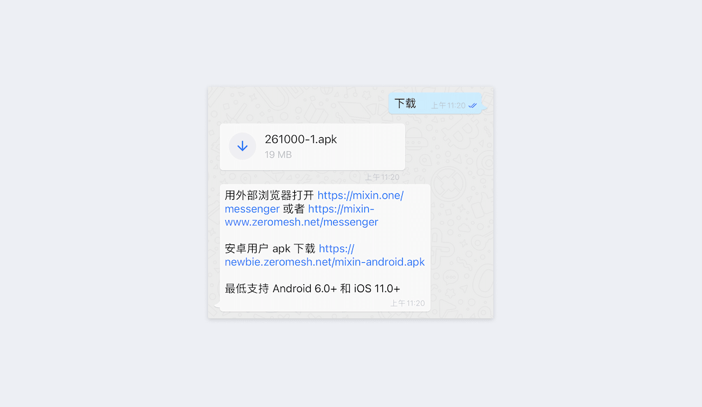
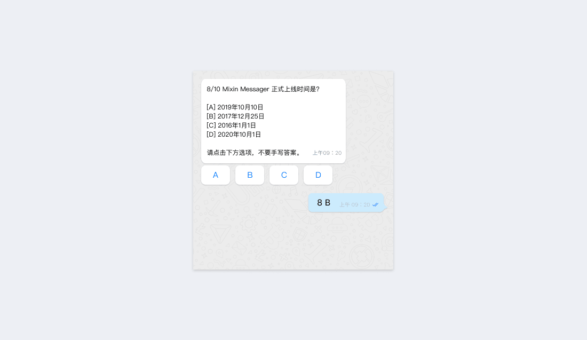

# User Interaction

Users interact with bots through web pages and chats.

### Web Page Interaction

Users can open the bot homepage for interaction through the following 3 ways:

- Chat Bottom Menu

  

  When the user opens the conversation interface of the bot, click the bot icon at the bottom to open the bot homepage.

- Menu In The Lower Left Corner Of The Chat

  

  When a bot is added as a group member or set as a shared bot by a user, it will show up if you click the menu in the lower-left corner of the chat interface. clicking the icon will take you to the bot homepage.

- Bot Popup

  

  On the personal page of the bot, clicking the bot icon in the lower-left corner will open the homepage of the bot.

### Chat Window Interaction

Click on the bot from the chat list on the homepage or click on the conversation from the bot pop-up window to enter the interactive mode of the chat window. Usually, the user will leave a message and ask a question. The bot will automatically or manually reply to the user with text, pictures, cards, and other content. The following prompt will be displayed when the user opens the chat window with a bot for the first time:

Click the "Open Homepage" button to open the bot homepage, and click "Hello" to send a text message of `Hi` to the bot.

- Passive Response

  When the user adds the current bot as a contact, the bot will receive a message "Hello" from the system. The bot will reply with the introduction of itself and guide the user on how to use it. Furthermore, a paragraph of text, plus one or more buttons could be sent to the user, so that the user can click a button to open the bot homepage or get more introduction information, for example:

  

  When a user encounters a problem and leaves a message to the bot, the bot should set some keywords to automatically reply. If the question cannot be answered with keywords, it should be forwarded to the customer service or the developer to help the user solve the problem.

  

  Bot Team Mixin 7000 is the official customer service bot for Mixin Messenger. If users have questions, they can leave a message, or send "download" to get automatic response content.

- Active Push

  Bots will push important notifications to users, such as new events or announcements:

  

  If the content is short, it is recommended to push text messages. If the content is long, it is recommended to push as a POST article message， which supports the markdown format. Send the markdown content to the 7000103014 bot to convert it to the POST article message format.
  
- Command Interaction

  Command interaction is cool, but it is a steep learning curve on the user side. Set the action of APP_BUTTON in the format `input:SOMETHING` to get the ability to automatically send messages by clicking the button, which is very practical. For example, the action of the current App Button is `input:subscribe`. When the user clicks this button, the client will automatically send a message with the text `subscribe` to the bot, and the developer can arbitrarily specify the text after `input`.

  

  The actions of the above 4 buttons are `input:8 A`, `input:8 B`, `input:8 C`, and `input:8 D`. When the user clicks the button, the client will automatically send `8 A`, `8 B`, `8 C`, and `8 D`.
