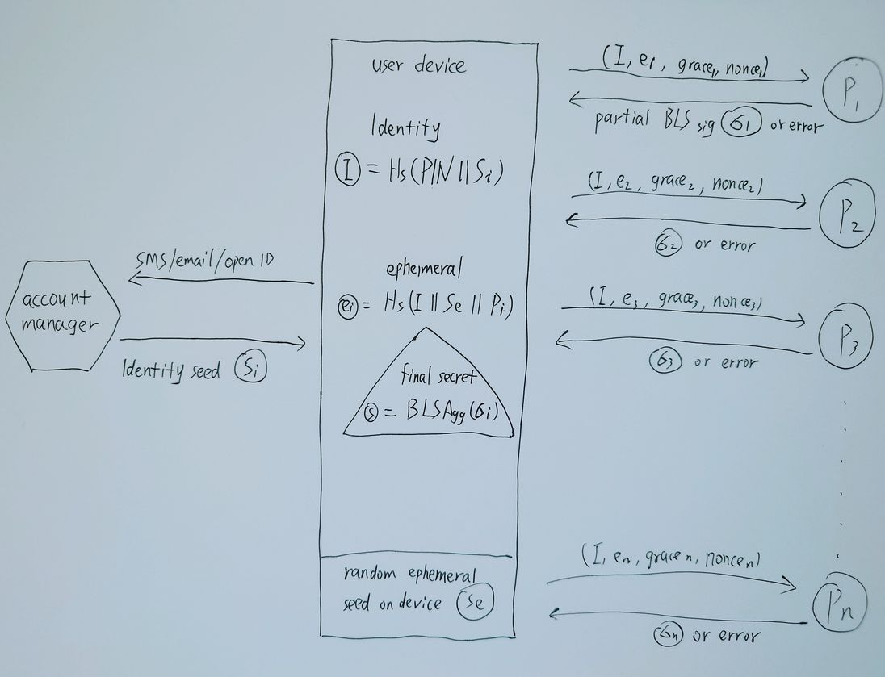

# Throttled Identity Protocol

Throttled Identity Protocol (TIP) is a decentralized key derivation protocol, which allows people to obtain a strong secret key through a very simple passphrase, e.g. a six-digit PIN.

### Mission and Overview

Along with the rising of Bitcoin and other cryptocurrencies, the saying "not your keys, not your coins" has become well-known. That's true, very true and definitely true, that's the right and freedom Bitcoin has given people. Whoever can access the key can move the money, and nobody without the key is able to do that.

That said it's better to manage your own Bitcoin private key than let your coins lie in some centralized exchanges. However it's admitted that key management requires superior skills, which most people lack. And the result is people who own their keys lose the coins permanently due to various accidents, and those who opened a Coinbase account years ago can still get back their assets easily.

The embarrassing result doesn't prove the security of centralized exchanges, yet exposes the drawbacks of key management. The key grants people the right to truly own their properties, but people lose money due to poor key management skills. People should not be blamed for that, it's the problem of the key itself.

Bitcoin gives people the right and freedom to own their properties, and people deserve the convenience to manage their keys. Current private key or mnemonic phrase design are over complicated for people to keep properly. Instead of fearing the corruption of centralized financial institutions, people become slave of private key.

It's what TIP strives to do. Let people truly own their coins with a six-digit PIN. This decentralized PIN is easy to remember for any people, doesn't require any special skills or hardware, and people can manage their coins with more confidence than ever.

### Protocol Design

TIP involves three independent parties to make the protocol work. A decentralized signer network authenticates signing requests from user, and throttles malicious attempts; A trusted account manager serves user an identity seed, which typically authenticates user by email or phone verification code; The user who remembers a PIN and combines the identity seed from account manager, then makes independent requests to enough signer network nodes, and finally derives their secret key.

### Decentralized Network Setup

The decentralized signer network is launched cooperatively by many different entities. Specifically, those entities gather and reach a consensus to run some node software, those nodes interactively run a distributed key generation protocol. For TIP, the DKG is threshold Boneh-Lynn-Shacham (BLS) signatures.

Assume n entities agree to launch the network, they generate an asymmetric key pair respectively and configure their node software to include all the entities public keys in a deterministic order. Then they boot the nodes to run a t-of-n (where t = n * 2 / 3 + 1) DKG protocol to setup a collective public key P and private key shares si respectively.

After the DKG protocol finishes, all entities should share the public key P to ensure they hold they same one, and keep their private key shares si cautiously, and should make professional backups.

Finally all entities should boot their node software to accept throttled signing requests from users. And again, they should safeguard the node servers and defend all malicious attacks.

This repository includes an implementation of the signer node software, for instructions please see the signer directory.

### Throttled Secret Derivation

The network announces the configuration and signers list to the public or potential users, and waits for signing requests. Each signer should throttle the requests based on the same restrictions.

- **Identity**. This is the base factor to all restrictions, the identity should be a valid BLS public key, and a user should use the same identity for all signers. The signer checks the request and verifies the request signature against the public key, and the signer must reduce the requests quota of this identity for any invalid signature.
- **Ephemeral**. This parameter is a different random value for each signer, but should remain unchanged for the same signer during the ephemeral grace period. If the ephemeral changes during the grace period, the signer must reduce the ephemeral requests quota of this identity.
- **Nonce**. For each signing request, the user should increase the nonce during the ephemeral grace period. If the nonce is invalid during the grace period, the signer must reduce the ephemeral requests quota of this identity.

After the signing request passes all throttle checks, the signer responds back a partial of the t-of-n threshold BLS signature by signing the identity. Whenever the user collects t valid partials, they can recover the final collective signature and verify it with the collective public key.

The final collective signature is the seed to the secret key of the user. Then it's up to the user to use different algorithm to generate their private key for Bitcoin or other usages. It doesn't need any further requests to use this secret key, and in case of the loss the user can recover it by making the same requests.

For details of the throttle restrictions, please see the keeper directory.

## Threshold Identity Generation

The mission of TIP network is to let people truly own their coins by only remembering a 6-digit PIN, so they should not have the duty to store identity, ephemeral or nonce. They is capable of achieving this goal through the threshold identity generation process with the help from the trusted account manager.

1. User authenticates themself with trusted account manager through email or phone verification code, and the manager responds the identity seed Si.
2. User chooses a very slow hash function Hs, e.g. argon2id, and generates the identity I = Hs(PIN || Si).
3. User generates a random ephemeral seed Se, and stores the seed on its device securely.
4. For each signer i in the network with public key Pi, user generates the ephemeral ei = Hs(I || Se || Pi).
5. User sends signing requests (I, ei, nonce, grace) to each signer i and gathers enough partial signatures, then recover the final collective signature.
6. User must repeat the process every a while to refresh ephemeral grace period.

The identity seed should prohibit all impersonation, and the on device random ephemeral seed should prevent the account manager collude with some signer, and the ephemeral grace period allows user to recover its secret key when device loss.

Furthermore, the user can make their threshold identity generation more secure by cooperating with another user to combine their identity to increase the entropy especially when the account manager manages lots of identities.

And finally, the user can just backup his seeds like any traditional key management process, and this backup is considered more secure against loss or theft.

### Network Evolution

Once the decentralized signer network is launched, its signers should remain constant, no new entity is permitted to join the signers or replace an old signer, because the DKG protocol remains valid only when all shares remain unchanged. But people need the network to become stronger, and that requires more entities to join the network. So TIP allows network evolution.

Whenever a new entity is accepted to the network, either replaces an old signer or joins as a new one, an evolution happens. Indeed, an evolution starts a fresh DKG protocol in the same process as the previous evolution, but with different signers, thus results in absolutely different shares for each signer. It's noted that an entity leaves the network doesn't result in any evolution, because the remaining shares can still serve requests.

In a new evolution, all signers should reference the number and the hash of signers list from previous evolution. After a new evolution starts, the previous evolution still works. For each signer in the new evolution, if it is a signer of previous evolution, it must maintain its availability to serve signing requests to previous evolution, otherwise it should be punished.

Any user requests for the throttled secret derivation should include the evolution number to get the correct signature. And in any case of the network changes, the user is assured their key security due to various backups discussed in previous sections.

### Incentive and Punishment

The code doesn't include any incentive or punishment for the entities running the signer node software. It's up to their consensus on their mission, either to serve their customers better user experience, or charge a small key signing request fee, or they could make some tokens to do community development.

### Security

All the cryptography libraries used in this repository are being developed and used by industry leading institutions, notably the drand project and its league of entropy that includes Cloudflare, EPFL, Kudelski Security, Protocol Labs, Celo, UCL, and UIUC.

However there are no finished audits for this repository yet. This code is offered as-is, and without warranty of any kind. It will need an independent security review before it should be considered ready for use in security-critical applications.

### Contribution

The project doesn't accept feature requests, and welcome all security improvement contributions. Shall you find any security issues, please email security@mixin.one before any public disclosures or pull requests.

The core team highly values the contributions and provides at most $100K bounty for any vulnerability report according to the severity.

### Code and License

The TIP implementation <https://github.com/MixinNetwork/tip> is released under Apache 2.0 license.
