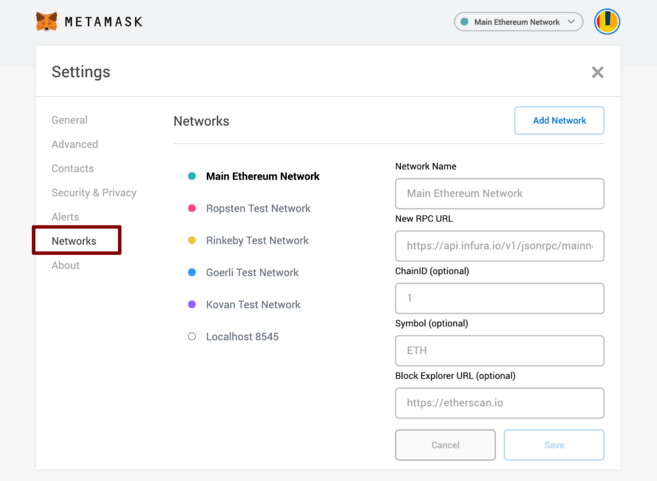

## Installation

The first thing you’ll need to do is download the MetaMask wallet software onto your chosen device by visiting the official website [here](https://metamask.io/). You will be presented with the following options:

1. Browser: Compatible with Google Chrome, Firefox, Brave or Edge website browser.
2. Android: Compatible with any smartphone that operates using Android’s operating system.
3. iOS: Compatible with any iPhone.

Select the “Create a Wallet” option, agree to a short disclaimer that appears and create a password when prompted. As with any password, it’s vitally important you physically write several copies of the password down on different pieces of paper. You should never create a digital copy of any password you create; this includes actions like taking a screenshot of it, sending it to yourself in an email or saving it as a note on your computer. Anything digital that’s stored on your computer is accessible to hackers.

You will need to enter your password each time you wish to access your MetaMask wallet.

## Setup a wallet

By default Metamask is connected to the ETH mainnet, we need to set up MVM testnet informations in 'Settings' like below.

Select 'Settings' from the drop-down menu, then find the 'Networks' menu.

Click 'Add Networks',and input the information below in the corresponding inputs.

- Network Name：Quorum Test
- New RPC URL：[https://quorum-testnet.mixin.zone/](https://quorum-testnet.mixin.zone/)
- ChainID：83927
- Symbol：RUM
- Block Explorer URL：[https://testnet.mvmscan.com/](https://testnet.mvmscan.com/)

And then you can use the transfer function and deploy contract with web3jd.
