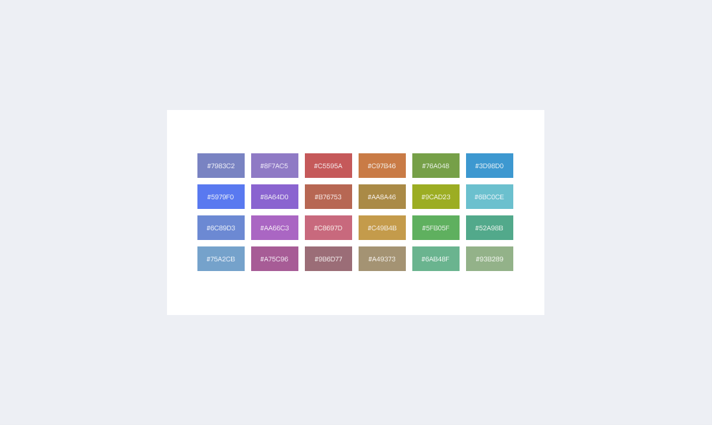
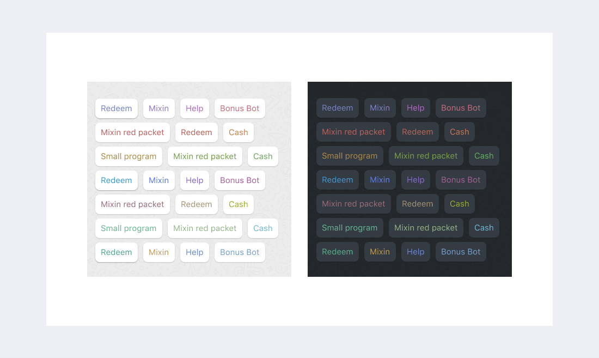

# 色

### テーマカラー

ユーザーがボットのページにアクセスすると、内蔵ブラウザがHTMLからテーマカラーのメタタグを抽出しようとし、ステータスバーやタイトルバーが自動的にテーマカラーに適応されます：

```html
<meta name="theme-color" content="#673ab8">
```

### ボタンの色


明るすぎたり暗すぎたりするボタンカラーは、ユーザー体験を低下させます。デザイナーは開発者のために、明るいモードでも暗いモードでもうまく機能するボタンカラーを選びました：



色配列：

```
[
    0x7983C2, 0x8F7AC5, 0xC5595A, 0xC97B46, 0x76A048, 0x3D98D0,
    0x5979F0, 0x8A64D0, 0xB76753, 0xAA8A46, 0x9CAD23, 0x6BC0CE,
    0x6C89D3, 0xAA66C3, 0xC8697D, 0xC49B4B, 0x5FB05F, 0x52A98B,
    0x75A2CB, 0xA75C96, 0x9B6D77, 0xA49373, 0x6AB48F, 0x93B289,
]
```

デモ：


