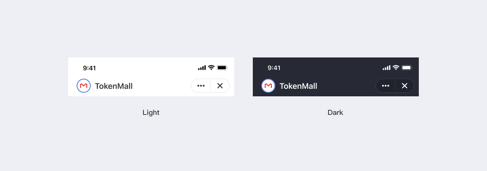

# ダークモード

Mixin Messengerクライアント適応システムのライトモード及びダークモード、ロボットインターフェースも適応しています：

ボットインターフェースを含むMixinメッセンジャーアプリは、ネイティブシステムのライトモードまたはダークモードに自動的に適応します：

ボットはJSを通じてクライアントの正確な外観モデルを取得し、それに適応することで、ユーザーがより一貫性のある体験を得ることができます。 [ドキュメント](../get-started/js)を参照してください。
