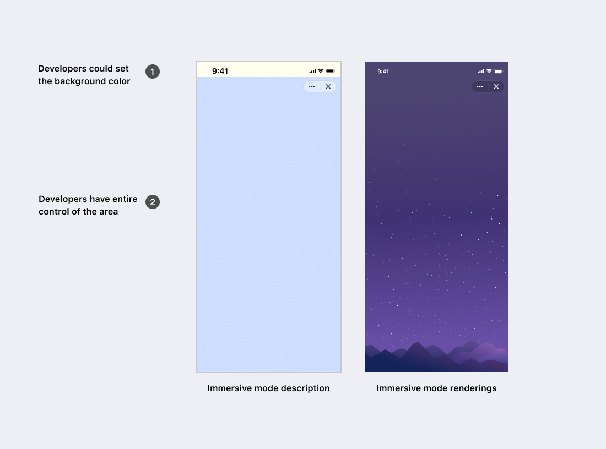

# 没入モード

没入モードでは、開発者はステータスバー以外の画面のすべての領域をコントロールすることができ、テーマカラーの補完により、フルスクリーン効果を実現することができます。

### 有効化

 [ダッシュボード](/dashboard)にアクセスし、左をクリックして現在のボットを選択し、「情報」ページを一番下までスクロールして「没入モード」にチェックを入れ、「保存」をクリックします。

### デザイン適応

右側のレンダリングは、没入モードを完璧に解釈しています。テーマカラーはグラデーションカラーをサポートしないことに注意してください。

### 実例

- 7000103066を検索して「DonateCafe」botを体験してください。

- 7000103214を検索して「red envelope」botを体験してください。 
  
- 7000103013を検索して「TaskWall」botを体験してください。 

### 参考

- [色](./color)

  没入モードとテーマカラーが絶妙にマッチしています。

-[フローティングメニュー](./floating-menu)

  開発者は、没入モードをオンにした後のインタラクションを設計する際に、右上隅にある固定フローティングメニューエリアを避ける必要があります。
