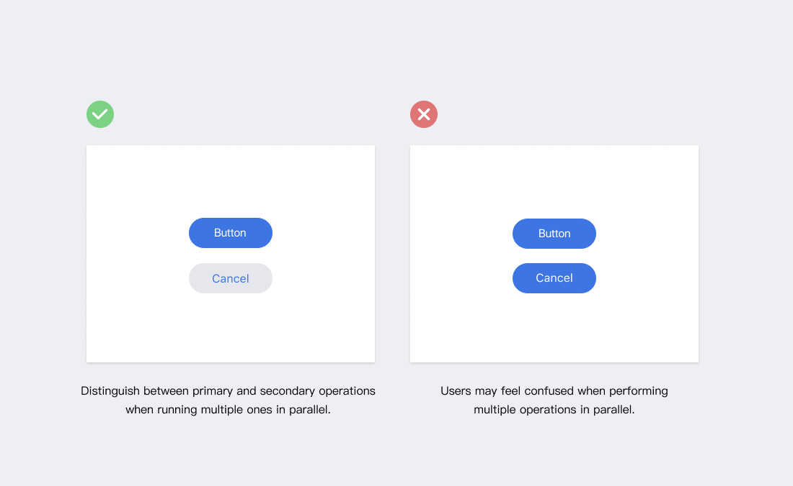
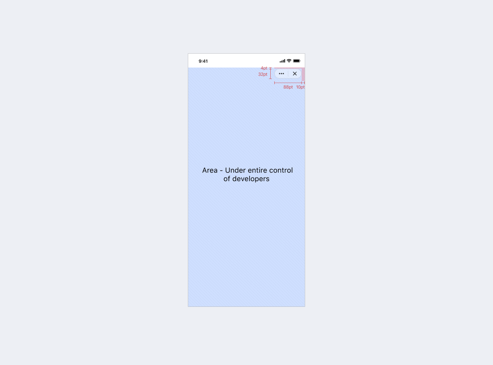

# 概要

Mixin Messengerボットデザインガイドは、ユーザーに使いやすく、効率的かつ一貫したユーザー体験を提供し、開発者がインターフェースをより良く適応させ、コンテナがサポートする機能を十分に活用できるようにすることを目的としています。

### 整合性

- 視覚的整合性

  ボットのフォント、色、ボタン、ラベルなどは統一されている必要があります。

- 機能の整合性

  ボット各ページにおけるインタラクションの方法と要素は一貫している必要があります。

- プラットフォーム仕様に従う

  AndroidとiOSのインターフェースデザイン仕様に準拠し、プラットフォームユーザーのインタラクションとルックに適合したデザインを提供します。

### 明確なハイライト

ユーザーが容易に内容を理解できるように、ハイライトや階層を明確にし、内容と無関係な要素はなるべく避けるようにします。

### インプットの最小化
  
ボットを設計する際のユーザーの入力を最小限にとどめ、既存のインターフェースや操作しやすいいくつかの選択肢を利用して、ユーザーの入力体験を向上させます。例えば、携帯電話番号の入力が必要なところでは、ユーザーが再度入力する手間を省くために、認証を申請することができます。

### スムースな体験

- 長時間のページ待ちを回避し、ネットワークとページのパフォーマンスを最適化することで、アクセス速度を向上させることができます。

- やむなく操作に待ち時間が発生する場合は、読み込みや待ち時間にアニメーション効果を表示することで、ユーザーの気持ちを和らげることが可能です。

- 待ち時間が長くなる場合は、プログレスバーやキャンセルボタンを設けることが望ましいです。

### ボットマヌの回避

ボットメニューは右上に固定されています。オクルージョンによるインタラクションの衝突を避けるため、開発者はインターフェイスを設計する際にこの領域にスペースを確保する必要があります。

### 通知過多の回避

重要な情報のみユーザーに通知されます。通知が多すぎると、ユーザー体験が下がりボットをミュートしたり、ブロックしたりすることがあります。通知すべき情報が多い場合は、ユーザーがプッシュ通知の種類を選べるようにすべきです。

### 次のステップ

親しみやすいデザインは、意図的な誘導を必要としません。私たちが目指すのは、ユーザーのニーズに応えつつ、ユーザーが一目で使い方を理解できる使い勝手の良いインターフェイスを提供することです。

- [ユーザーボットインタラクション](./user-interaction)

  ロボットとユーザーとのインタラクションを熟知することで、デザイナーはインタラクティブな体験を最適化することができます。
