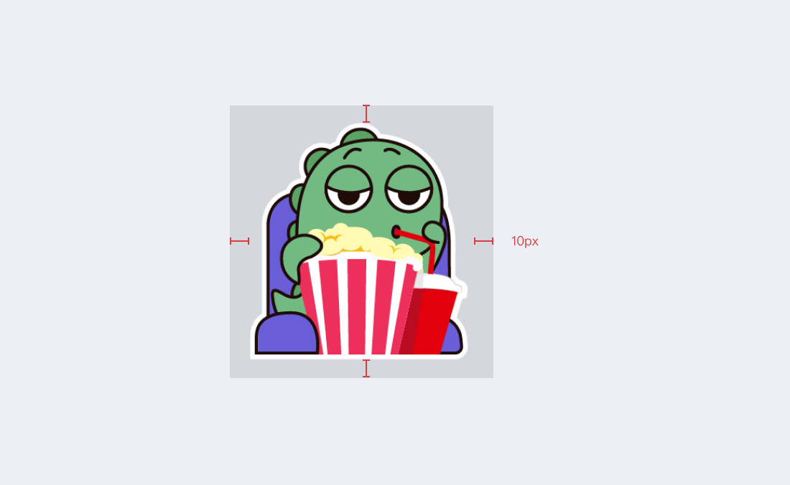

# ステッカー

アーティストは自作のステッカーをMixinメッセンジャーに提出することが可能です。

### 要求

- 作品の著作権：投稿者が作品の著作権を有していること。
- ステッカーサイズ：最小128ピクセル、最大512ピクセル、360×360ピクセル推奨。
- ステッカーの数：9シート、12シート、15シート、18シート、21シート、24シート、27シート、30シート。
- ステッカーフォーマット：png、jpg、gif、Lottie、WebP、Animated WebP。
- ステッカーバナー：アスペクト比16:10、推奨320×200ピクセル。
- ラベルアイコン: 40x40ピクセル推奨。
- ファイルサイズ：最小1kb、最大800kb。
- 命名規則：ステッカーファイル名は "01.png", "02.png", "30.png "などの数字で、バナーファイル名は "banner.png"、ラベルは "thumb.png "である必要があります。

### 作成ガイド

- ステッカーパディング

  

### ステッカーの提出

ステッカー、ラベルアイコン、バナー画像に名前を付け、著作権ファイル([テンプレートダウンロード](http://www.mixinbots.com/docs/sticker-copyright-notice.doc)) と一緒にZIP形式または7z形式に圧縮し、Mixin Messenger 1039549に送信してください。
