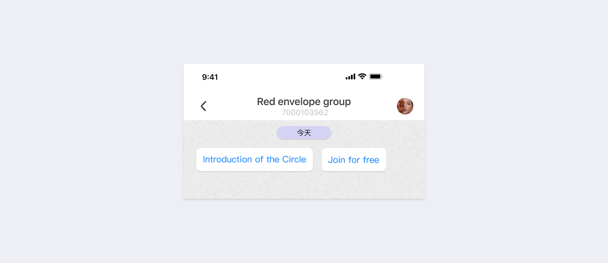

# ユーザーインタラクション

ユーザーは、ウェブページやチャットを通じてボットと対話することが可能です。

### Webページインタラクション

ユーザーは、以下の4つの方法でボットホームページを開き、対話することができます。

- ホームページスーパーエントランス

  Telegram、Facebook Messenger、WeChatなどのチャットソフトは、すべてボット（またはミニプログラム）機能をサポートしています。基本的なチャット機能の延長線上にあるものとして、いずれも重要視されています。Mixinはさらに、ホームページのナビゲーションメニューの権利をユーザーに委ね、第一階層の入口をボット開発に委ねます。ユーザーは自分の好きなボットや、よく使うボットをホームに載せることができ、ボットが第一階層の入り口となることで、ユーザーはよりボットを使う頻度が高くなりました。
  
  

  ユーザーは、アイコンを長押ししてホームページ下部のメニューに固定することができ、アイコンをクリックすることでボットホームページを開くことが可能です。
  
  **バージョン0.28.0から、ホームページ下部メニューは3つのボットピンに対応しています（旧バージョンは2つ）。**

- チャット下部メニュー

  

  ユーザーがボットのチャットインターフェースを開いたとき、下部にあるボットアイコンをクリックすると、ボットのホームページが表示されます。

- チャット左下のメニュー

  

  ボットをグループメンバーに追加したり、ユーザーから共有ボットとして設定された場合、チャットインターフェースの左下にあるメニューをクリックすると表示されます。アイコンをクリックすると、ボットのホームページが表示されます。

- ボットポップアップ

  

  ボットの個人ページで、左下のボットアイコンをクリックすると、ボットのホームページが表示されます。

### チャットウィンドウインタラクション

ホームページのチャットリストからボットをクリックするか、ボットのポップアップウィンドウから会話をクリックすると、チャットウィンドウの対話モードに入ります。通常、ユーザーはメッセージを残したり、質問をしたりします。ボットは、テキスト、画像、カード、その他のコンテンツでユーザーに自動的または手動で返信します。ユーザーが初めてボットとのチャットウィンドウを開くと、次のようなプロンプトが表示されます：

「ホームページを開く」をクリックすると、ボットのホームページが開きます。「こんにちは」をクリックすると、ボットに「こんにちは」というテキストメッセージが送信されます。

- 受動的応答

  ユーザーが現在のボットを連絡先として追加すると、ボットはシステムから「こんにちは」というメッセージを受け取ります。ボットは自己紹介を兼ねて返信し、使い方を案内します。さらに、テキストの段落と1つ以上のボタンをユーザーに送信し、ユーザーがボタンをクリックすることで、ボットのホームページを開いたり、より詳しい紹介情報を得たりできるようにすることも可能です。

  

  ユーザーが何か問題に遭遇し、ボットにメッセージを送信した際に、ボットはいくつかの設定されたキーワードを自動的に返信します。キーワードで答えられない質問は、カスタマーサービスや開発者に転送し、ユーザーが問題を解決できるようにします。

  

  Bot Team Mixin 7000は、Mixin Messengerの公式カスタマーサービスボットです。ユーザーが質問をした場合、メッセージを残したり、「ダウンロード」と送信することで自動応答コンテンツを取得することができます。

- アクティブプッシュ

  ボットは、新しいイベントやお知らせなど、重要なお知らせをユーザーにプッシュします。

  

  コンテンツが短い場合は、テキストメッセージをプッシュすることをお勧めします。コンテンツが長い場合は、マークダウン形式をサポートするPOST article messageとしてプッシュすることをお勧めします。マークダウンコンテンツを7000103014ボットに送信し、POST articleメッセージ形式に変換します。
  
- コマンドインタラクション

  コマンドによる対話は便利ですが、ユーザー側の負担は大きくなります。APP_BUTTON のアクションを 「input:SOMETHING」 というフォーマットで設定すると、ボタンをクリックすることで自動的にメッセージを送信する機能を得ることができ、非常に実用的です。例えば、現在のApp Buttonのアクションは 「input:subscribe`」です。ユーザーがこのボタンをクリックすると、クライアントは自動的に 「subscribe」 というテキストを含むメッセージをボットに送信します。開発者は 「input`」の後に任意でテキストを指定することができます。

  

  上記の4つのボタンのアクションは 「input:8 A」、「input:8 B」、「input:8 C」、「input:8 D」です。ユーザーがボタンをクリックすると、クライアントは自動的に 「8 A」、 「8 B」、「8 C」、「8 D」を送信します。
