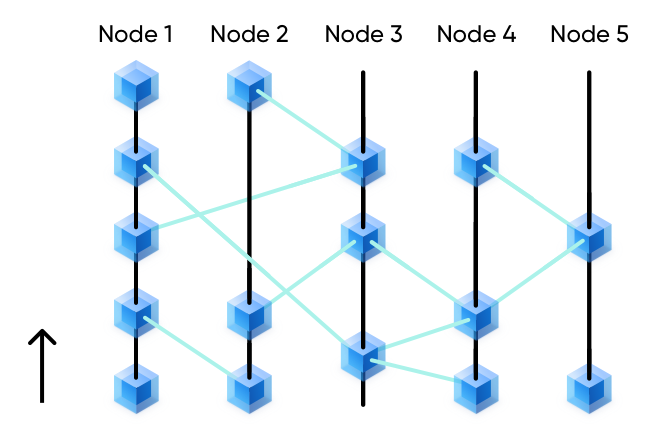

# フルノード
ビットコインネットワークやイーサリアムなどのパブリックチェーンと同様、Mixinもまた、誰でもフルノードになることができるオープンなパーミッションレスネットワークです。選挙はなく、前年度に流通したトークンの2％を担保に入れることが唯一の条件となっています。

### 推奨スペック
- __Memeory__ 64G
- __CPU__ 16コア
- __Storage__ 1T SSD（SSDは必須です）
- __Bandwidth__ 現時点では必要なし

### ノード数
限られたノード数であることは高いパフォーマンスを発揮する要因の1つです。Mixinネットワークは最大50のフルノードをサポートし、最低で7ノードが必要です。

  ### ノード記帳
  フルノードの主な仕事は、Mixinネットワーク上のすべての取引を検証し記録する記帳作業です。

- 各トランザクションは、このノードと他のノードの記録を参照する必要があり、参照の高さは増加している必要があります

  

- 各ノードは異なる順序で取引を記録することができるため、取引の非同期同時処理が可能であり、これは各ノードが独立したブロックチェーンであると理解することができます。

  

## アセット管理
ドメインが担保する以上の資産を管理する場合、メインネットノードが共同管理するマルチシグネチャーのコールドウォレットアドレスに資産を強制的に移管することになります。

## ノード報酬
90% of 10% of all leftover mining pool tokens from last year will be given to full nodes(10% for light nodes). The distribution cycle is once a day, the nodes are distributed equally. Currently, the daily income of each node is 110.95890408 XIN / 35 nodes = 3.1702544 XIN.
マイニングプールにおける前年度残存トークンの10%のうち90%がフルノードに（ライトノードには10%）付与されます。1日1回の配布サイクルで、各ノードに均等に配布すると、各ノードの1日の収入は110.95890408 XIN / 35ノード = 3.1702544 XINとなります。

### 不正行為に対する罰則規定
If a full node commits evil, such as broadcasting an obvious double-spending transaction, it will be marked as a potential attacker. Once a full node is confirmed as an attacker, all its collateral will be recycled into the mining pool and it will be kicked out of the node network.
あるノードが明らかな二重支出のトランザクションをブロードキャストするなど不正を働いた場合、そのノードは潜在的な攻撃者として疑いがかけられ、攻撃者として特定されるとすべての担保はマイニングプールに没収され、ノードネットワークから追放されます。

When a node launches an attack for the first time, its rights and interests won't be revoked immediately, but it will be marked as a potential attacker. The number of kernel consensus nodes will temporarily decrease by 1. Note that this decrease is invisible to potential attackers. If the potentially attacking node continues to broadcast illegal transactions, the kernel will mark the node and the collateral of the node will be transferred to the mining pool. The marked node can appeal within a period.
あるノードが初めて攻撃を行った場合、そのノードの権利や利益はすぐには剥奪されませんが、潜在的な攻撃者として疑いがかけられ、カーネルのコンセンサスノード数が一時的に1つ減らされます（この減少は潜在的な攻撃者には見えないことに注意してください）。 潜在的な攻撃ノードが違法な取引をブロードキャストし続けた場合、カーネルはそのノードをマークし、そのノードの担保はマイニングプールに移されることになります。マークされたノードは一定期間不服を申し立てることができます。

## Mixinフルノードとして参加

[Full Node Joining Guide](../tutorials/full-node-join)
