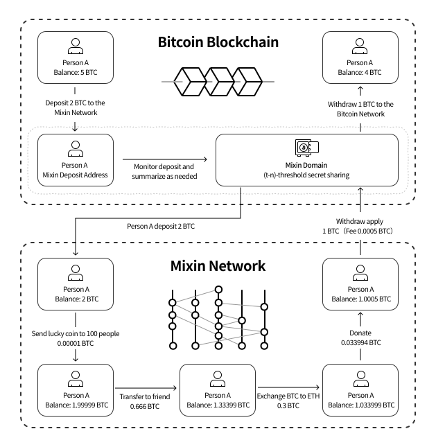
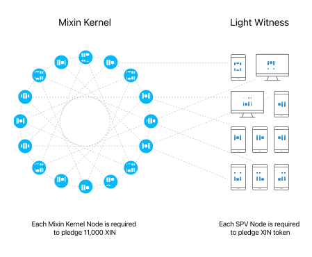
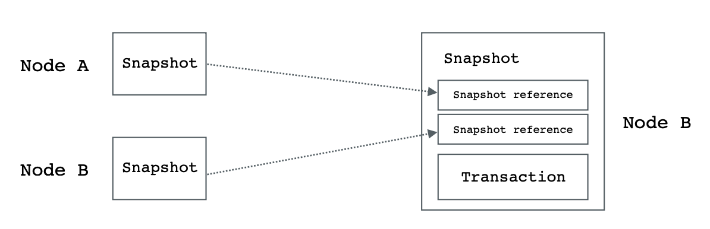

# How it Works

Mixinは、デジタルアセットのための無料かつ高速なP2Pクロスチェーン取引ネットワークです。ドメインゲートウェイを通じて、Bitcoin、Ethereum、Monero、その他多くのパブリックチェーンアセットがMixinネットワークに持ち込まれます。すべてのオフチェーントランザクションは公開されたMixin分散型台帳に記録され、引き出しが行われる際にブロックチェーンに書き込まれます。

### 分散型台帳

Mixinの分散型台帳はオープンで透明性が高く、35のメインネットノードによって一括して記帳・管理されています。すべての入出金や送金はこの分散型台帳に記録され、それぞれの記録には資産の種類（ビットコイン、イーサリアムなど）、送金額などの情報が含まれています。

- ノード
 
　各メインネットノードは、帳簿管理に参加するために11,000XIN（流通量の2％）を担保に入れる必要があります。明らかな二重支出の取引を意図的に広めるなど、攻撃者として特定された場合、その担保はマイニングプールに没収されます。

　Mixinは、TEEの実装にIntel SGXを採用し、さらなるセキュリティの向上を図っています。すべてのメインネットノードは、メインネットノードの「実行中のコード」が真に「実行中と主張するコード」であることを保証するために、信頼できる実行環境で実行されなければなりません。信頼された実行環境では、誰にも気づかれずに実行中のコードを変更することはできません。

　SPVライトノードは、メインネットワークノードを監視し、不正を防止します。0.1 XIN単位のXINを担保に入れたユーザーであれば、誰でも参加可能です。自身のUTXO変化とノードのトポロジー順序を記録することで、ノードが不正を働いているかを検出することができます。
  

- DAG

　Mixinは、データ構造の基本モデルとしてDAGを使用しています。他のパブリックDAGチェーン（IOTA、Bytaballなど）とは異なり、Mixinは中央権威ノードを持たず、データは中央権威ノードからの最終確認を待つ必要がありません。データの参照時間を制限するなどの仕組みにより、非同期で効率的な運用を実現し、Asynchronous Byzantine Algorithmにより合意結果の正しさを保証しています。簡潔に言えば、Mixinの各ノードは完全なデータを持ったチェーンであり、データの順番が違っても最終的に同じ結果を導き出すことが可能です。
 
- プライバシー

　UTXOトランザクションプライバシーは、CryptoNoteテクノロジーによって強化されています。取引の内容を知っているのは両当事者だけで、メインネットノードは取引の当事者を知ることができず、取引そのものから取引当事者の身元を把握することは不可能です。

  **なお、Mixinには通貨発行機能はなく、無から資産を生み出すことはありません。メインネットトークンは常にERC-20トークンです。**

### アセットマネジメント

- ドメインゲートウェイ

　Mixinドメインは、Mixin Networkのゲートウェイとして、オンチェーンアセットの入出金を管理する重要な役割を担っています。許可を必要としないメインネットノードへの参加とは異なり、ドメインのゲートウェイは多額のXINを担保に入れる必要があるほか、全ノードの同意が得られた場合にのみ参加することができます。アセット量の増加に伴い、アセット管理を分散化するため、複数のドメインが存在することになります。現在のドメインは、Mixinチームが5万XINをプレッジして管理しています（以下、「ドメイン」と表記）。

　ドメインは、オンチェーンアセットの完全な秘密鍵（ビットコインの秘密鍵など）を持っているわけではありません。秘密鍵はキーシャーディング技術によってノードとドメインが保管します。シャードキーには複数のバックアップがあり、一部のバックアップが失われたり漏洩したりしても、鍵が失われることはありません。ユーザーが出金する際には、メインネットノードとドメインがそれぞれ(t-n)閾値署名技術により署名し、最後にすべてをマージして完全な署名にすることで送金を行います。

- メインネットコールドウォレット

ドメインゲートウェイが管理する資産が担保価値を大幅に超えた場合、ドメインの資産は35ノードが共同管理するコールドウォレットアドレスに強制的に移管されます。

### トランザクションの記録

　アセットがMixinネットワーク内に移されると、すぐに手数料無料でリアルタイムな取引を行うことが可能になります。オリジナルのチェーン（ビットコインネットワークなど）では、取引はオフチェーンですが、Mixinの分散型台帳に記録され、オープンで透明性が高く、不可逆的なものとなります。

- 入金

　各ユーザーには固有の入金アドレスを生成（またはタグ/メモで区別）されますが、秘密鍵はドメインが管理し、必要に応じて集められます。また集められた資産はメインネットノードとドメインが共同管理します。

　ドメインがユーザーの入金を検知し、入金が確認回数に達すると、ユーザーの入金情報を含むトランザクションをノードに開始します。そしてノードがトランザクションを承認すると、ユーザーは新たに未使用のUTXOを所有し（資産残高が増加し）、そのトランザクションも分散台帳に記録されます。

- 送金

　ユーザーが送金を行うと、6桁のパスワード＋PINノード秘密鍵のシードを通じてマルチシグネチャトランザクションが生成され、メインネットノードに送信されます。このトランザクションは、ユーザーのノードと他のノードの過去のトランザクションを参照します。メインネットノードによってユーザーの署名の検証、未使用のUTXOが十分にあるかなどが確認され、さらに3分の2プラス1以上のノードが承認した場合にトランザクションは分散台帳に書き込まれます。

  

- 出金

　ユーザーが出金を開始する際には、出金先のアドレスを追加する必要があります。この処理は送金処理と同様であり、分散台帳に書き込まれることになります。ドメインはメインネットノードの出金の取引と署名を検出すると、取引と署名が確認された後に自動的に出金を手配します。(手動での審査はありません)。

　出金が遅れた場合、アドレス間違いに加え。ドメインがノードデータの同期に失敗して出金トランザクションが送信されていない可能性があります。（ID:7000101498のボットに登録すれば、失敗警告を受信できます）また、共同管理アドレスの資産が十分ではなく、一時資産の収集がトリガされたりしますが、この場合は数秒待てば解決します。

### FAQ

- Mixin, Mixin Network, Mixin Messengerの関係は？
  
　MixinはMixin Networkの略で、Mixin MessengerはMixin Networkの最初のオープンソースDappです。歴史的な理由により、Mixinは長い間Mixin Messengerとされていました。

- なぜMixinは電話番号でしかログインできないのですか？

　Mixin Messengerは電話番号でしかログインできないDappプロダクトですが、他のMixin NetworkベースのプロダクトはメールやApple IDなどでもログイン可能で、プロダクトによって異なります。例えば、[Poolin Wallet](http://poolin.fi)などがあります。

- なぜエアドロップはサポートされていないのですか？また、ブロックチェーンブラウザでウォレットのBTC入金アドレスの残高が取得できないのはなぜですか？

Mixinの入金と出金は同じアドレスを使用しません。ユーザが入金した後、ドメインゲートウェイとノードが共同で管理するアドレスに資産が転送されます。そして共同管理されたアドレスから目的のアドレスに出金する際には、3分の2+1以上のノードが確認と署名を行う必要があります。そのため、すべての入金先アドレスが空となり、残高の確認できないため、その残高に基づくエアドロップの受付ができないのです。
  
- Why aren't the BTC withdrawal addresses managed by the Domain multi-signature addresses?

  Because Bitcoin multi-signature can only support more than a dozen people and cannot support 35 nodes to do multi-signature. Even though Mixin's withdrawal address is an ordinary address, the private key is based on cryptographic key sharding and (t, n) threshold signatures, so the result is equally safe and reliable.

- Where is the Mixin blockchain browser?

  Blockchair, third party, https://blockchair.com/mixin

  Mixin core team, https://mixin.one/snapshots
