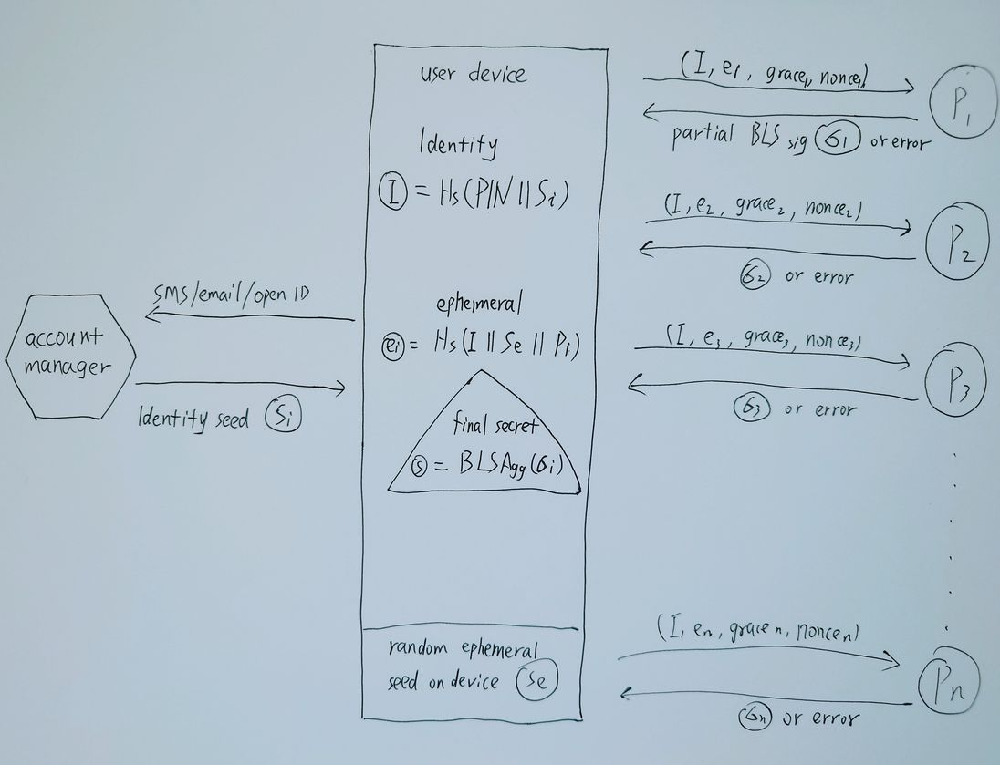

# Throttled Identity Protocol

Throttled Identity Protocol (TIP) は、分散型の鍵生成プロトコルであり、6桁の暗証番号など非常にシンプルなパスフレーズで強力な秘密鍵を得ることができます。

### ミッションと概要

ビットコインをはじめとする暗号通貨の隆盛とともに、「not your keys, not your coins」という言葉がよく知られるようになりました。それは、真実で、間違いなくビットコインが人々に与えた権利であり自由です。鍵にアクセスできる人はお金を動かすことができ、鍵を持っていない人はそれができないのです。

このことはつまり、中央集権的な取引所にコインを眠らせておくよりは、自分でビットコインの秘密鍵を管理するほうがいいということを示唆しています。しかし、鍵の管理には優れたスキルが必要であり、ほとんどの人はそのスキルを持ち合わせていません。その結果、鍵を自身で所有している人は様々なアクシデントでコインを永久に失うことになり、何年も前にコインベースのアカウントを開設した人は今でも簡単に資産を取り戻すことができます。

この恥ずかしい結果は、中央集権的な取引所の安全性を証明するものではありませんが、鍵管理の欠点を露呈しています。鍵は人々に自分の財産を真に所有する権利を与えますが、人々は鍵の管理能力の低さのために損失を被ることになります。しかし、その原因は人にあるのではなく、鍵そのものに問題があるのです。

ビットコインは人々に自分の財産を所有する権利と自由を与え、人々は自分の鍵を管理する利便性を得るに値します。現在の秘密鍵やニモニックフレーズのデザインは、人々が適切に管理するには複雑すぎます。中央集権的な金融機関の腐敗を恐れる代わりに、人々は秘密鍵の奴隷になるのです。

TIPの目指すところはここにあります。6桁の暗証番号で人々が本当に自分のコインを所有できるようにするのです。この分散型PINはどんな人でも覚えやすく、特別なスキルやハードウェアを必要とせず、人々はこれまで以上に自信を持って自分のコインを管理できるようになります。

### プロトコルデザイン

TIPは、プロトコルを動作させるために3つの独立した要素を含んでいます。分散型署名ネットワークは、ユーザーからの署名要求を認証し、悪意のある試みを抑制します。信頼できるアカウントマネージャーはユーザーにIDシードを提供し、通常、電子メールまたは電話認証コードによってユーザーを認証します。PINを覚えているユーザーは、アカウントマネージャーからのIDシードを組み合わせて、十分な数の署名ネットワークノードに独立して要求を行い、最後に自分の秘密鍵を導出します。

### 分散型ネットワークの構築

分散型署名ネットワークは、多くの異なる主体によって協調的に立ち上げられます。具体的には、これらの主体が集まり、コンセンサスを得て、ノードソフトウェアを実行し、そのノードは対話的に分散鍵生成プロトコルを実行します。TIPの場合、DKGは閾値ボネ・リン・シャチャム(BLS)署名です。

n個のエンティティがネットワークを立ち上げることに合意したとすると、それぞれ非対称鍵ペアを生成し、すべてのエンティティの公開鍵を決定論的な順序で含むようにノードソフトウェアを構成します。次にノードを起動し、t-of-n（ここでt = n * 2 / 3 + 1）のDKGプロトコルを実行して、公開鍵Pと秘密鍵shares siをそれぞれセットアップします。

DKGプロトコルの終了後、すべてのエンティティは公開鍵Pを共有して同じものを保持していることを確認し、秘密鍵shares siを慎重に保管し、専門的なバックアップを取る必要があります。

最後に、すべてのエンティティは、ユーザからスロットルされた署名要求を受け入れるために、ノードソフトウェアを起動する必要があります。そしてまた、ノードサーバーを保護し、すべての悪意ある攻撃を防御しなければなりません。

このリポジトリは署名者ノードソフトウェアの実装を含んでいます。説明については署名者ディレクトリを参照してください。

### 秘密分散法

ネットワークは設定と署名者リストを一般ユーザーまたは潜在的なユーザーに発表し、署名要求を待ちます。各署名者は、同じ制限に基づいて要求を絞り込む必要があります。

- **ID** IDはすべての制限の基本要因であり、IDは有効なBLS公開鍵でなければならず、ユーザーはすべての署名者に同じIDを使用しなければならない。署名者はリクエストをチェックし、公開鍵に対するリクエスト署名を検証する。署名者が無効な署名を行った場合、このIDのリクエストクォータを減らさなければならない。
- **Ephemeral**. This parameter is a different random value for each signer, but should remain unchanged for the same signer during the ephemeral grace period. If the ephemeral changes during the grace period, the signer must reduce the ephemeral requests quota of this identity.
- **Nonce**. For each signing request, the user should increase the nonce during the ephemeral grace period. If the nonce is invalid during the grace period, the signer must reduce the ephemeral requests quota of this identity.

After the signing request passes all throttle checks, the signer responds back a partial of the t-of-n threshold BLS signature by signing the identity. Whenever the user collects t valid partials, they can recover the final collective signature and verify it with the collective public key.

The final collective signature is the seed to the secret key of the user. Then it's up to the user to use different algorithm to generate their private key for Bitcoin or other usages. It doesn't need any further requests to use this secret key, and in case of the loss the user can recover it by making the same requests.

For details of the throttle restrictions, please see the keeper directory.

## Threshold Identity Generation

The mission of TIP network is to let people truly own their coins by only remembering a 6-digit PIN, so they should not have the duty to store identity, ephemeral or nonce. They is capable of achieving this goal through the threshold identity generation process with the help from the trusted account manager.

1. User authenticates themself with trusted account manager through email or phone verification code, and the manager responds the identity seed Si.
2. User chooses a very slow hash function Hs, e.g. argon2id, and generates the identity I = Hs(PIN || Si).
3. User generates a random ephemeral seed Se, and stores the seed on its device securely.
4. For each signer i in the network with public key Pi, user generates the ephemeral ei = Hs(I || Se || Pi).
5. User sends signing requests (I, ei, nonce, grace) to each signer i and gathers enough partial signatures, then recover the final collective signature.
6. User must repeat the process every a while to refresh ephemeral grace period.

The identity seed should prohibit all impersonation, and the on device random ephemeral seed should prevent the account manager collude with some signer, and the ephemeral grace period allows user to recover its secret key when device loss.

Furthermore, the user can make their threshold identity generation more secure by cooperating with another user to combine their identity to increase the entropy especially when the account manager manages lots of identities.

And finally, the user can just backup his seeds like any traditional key management process, and this backup is considered more secure against loss or theft.

### Network Evolution

Once the decentralized signer network is launched, its signers should remain constant, no new entity is permitted to join the signers or replace an old signer, because the DKG protocol remains valid only when all shares remain unchanged. But people need the network to become stronger, and that requires more entities to join the network. So TIP allows network evolution.

Whenever a new entity is accepted to the network, either replaces an old signer or joins as a new one, an evolution happens. Indeed, an evolution starts a fresh DKG protocol in the same process as the previous evolution, but with different signers, thus results in absolutely different shares for each signer. It's noted that an entity leaves the network doesn't result in any evolution, because the remaining shares can still serve requests.

In a new evolution, all signers should reference the number and the hash of signers list from previous evolution. After a new evolution starts, the previous evolution still works. For each signer in the new evolution, if it is a signer of previous evolution, it must maintain its availability to serve signing requests to previous evolution, otherwise it should be punished.

Any user requests for the throttled secret derivation should include the evolution number to get the correct signature. And in any case of the network changes, the user is assured their key security due to various backups discussed in previous sections.

### Incentive and Punishment

The code doesn't include any incentive or punishment for the entities running the signer node software. It's up to their consensus on their mission, either to serve their customers better user experience, or charge a small key signing request fee, or they could make some tokens to do community development.

### Security

All the cryptography libraries used in this repository are being developed and used by industry leading institutions, notably the drand project and its league of entropy that includes Cloudflare, EPFL, Kudelski Security, Protocol Labs, Celo, UCL, and UIUC.

However there are no finished audits for this repository yet. This code is offered as-is, and without warranty of any kind. It will need an independent security review before it should be considered ready for use in security-critical applications.

### Contribution

The project doesn't accept feature requests, and welcome all security improvement contributions. Shall you find any security issues, please email security@mixin.one before any public disclosures or pull requests.

The core team highly values the contributions and provides at most $100K bounty for any vulnerability report according to the severity.

### Code and License

The TIP implementation https://github.com/MixinNetwork/tip is released under Apache 2.0 license.
