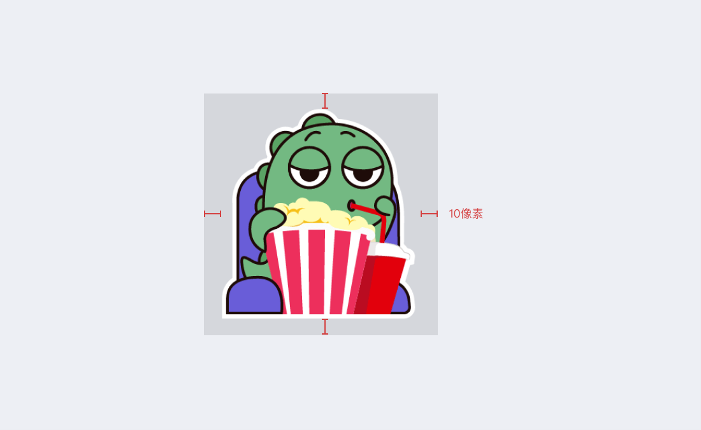

艺术家可以向 Mixin Messenger 提交贴纸作品。

## 要求

- 作品版权：提交作品者必须拥有作品的版权
- 贴纸尺寸：最小 256 像素、最大 512 像素, 推荐 512 x 512
- 贴纸数量：9 张，12 张，15 张，18 张，21 张，24 张，27 张，30 张
- 贴纸格式：WebP、Lottie
- 贴纸横幅：长宽比 16 : 10，推荐 960 x 600 像素
- 标签图标：推荐 96 x 96 像素
- 文件大小：最小 1 kb，最大 800kb
- 命名规范：贴纸文件名必须按照数字编号进行命名，例如 "01.happy.webp"、"02.exciting.webp"、"30.sobbing.webp", 前面是贴纸的显示顺序，后面是名字；横幅文件名必须是 "banner.png"；缩略图必须是 "thumb.webp"。
- manifest.json 文件, 如下
- 注意，只有 `is_verified` 的表情，出出现在商店里，如果需要可以跟管理员联系。

manifest.json 格式

```json
{
  "name": "piggy", // 不能为空，最大 64 字符
  "locale": "zh", // und 通用， en 英文， zh 中文
  "description": "piggy is lovely", // 可以为空，最大 256 个字符
}
```

## ZIP 目录结构

- 01.happy.webp
- 02.exciting.webp
- ...
- 30.sobbing.webp
- banner.png
- manifest.json
- thumb.webp

## 创作指南

- 贴纸留白

  

## 提交贴纸

将贴纸、标签图标、横幅图按规范命名然后和版权声明文件（[下载模版](http://www.mixinbots.com/docs/sticker-copyright-notice.doc)）一起打包成 zip 或 7z 通过 Mixin Messenger 发给 1039549 即可。
