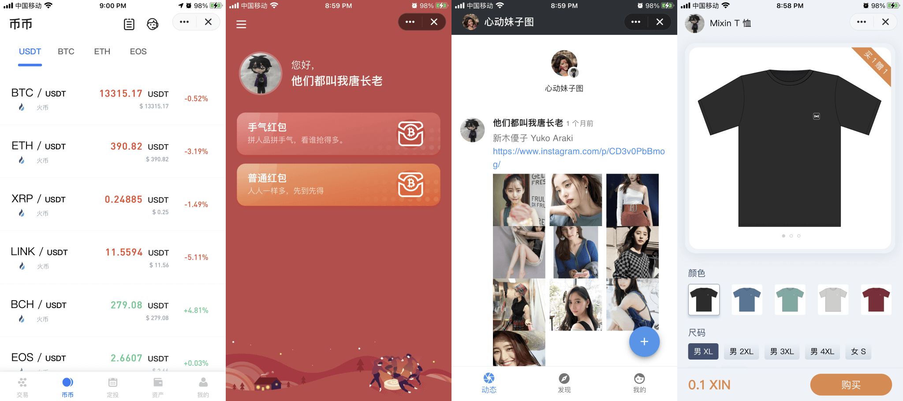

In addition to providing end-to-end encrypted chat and wallet functions, Mixin Messenger also supports bot functions similar to Telegram bots, WeChat mini-programs. Developers can easily implement powerful bots with functions such as transactions, paid circles, and e-commerce. You can search for 7000101700 to try a variety of selected bots.

### Advantages

- Production-ready

  Given the authorization, the bots can obtain the user's basic information, asset list, transfer records, contact list, and other data. Developers can use the data to develop products and services.

- Open

  You can put your bots online for your users without asking anyone's permission.

- Fair

  There is no official bot market, independent developers or teams need to promote bots by themselves, and users who have a good experience will put your bots on the top of the homepage to give your bots first-level entrance!

### Next Step

- [Developing Mixin Messenger Bots](./getting-started/create)

---

**To contact tech support, search for 762532、493230、31911 in Mixin Messenger**

# Mixin Wallet

Based on Mixin Network, products such as decentralized wallets and decentralized on-chain exchanges can be quickly developed.

### Features

- **Security** Security is guaranteed by open source PoS decentralized network, TEE hardware, and full nodes supervised by tens of thousands of light nodes to prevent evil.
- **High Concurrency** One million TPS, suitability for large-scale commercial scenarios, and performance close to that of traditional centralized servers.
- **Free** Zero fee transactions, competency in micropayment and everyday payment scenarios.
- **Instant Transfer** It only takes 300 milliseconds to complete the verification and signature of a transaction without transaction rollback or double spending.
- **Versatility** Supports for 32 chains, including BTC, ETH, EOS, XMR, etc., and more than 100 thousand tokens.
- **Easy to use** 6-digit password for safe management of the wallet, easy to remember, and easy to use.
- **Multi-signature** Support for co-management of multi-signature assets among up to 255 people. Suitability for teams and families who want to co-own a large amount of an asset, and B2C or C2C platforms who want to co-manage the fund to prevent the platform from embezzling the fund.
- **Transaction Privacy** Except for the parties themselves, even full nodes do not know who are the parties in a transaction, there is no way to know the identities of the parties in a transaction from the transaction itself.
- **Developer Friendly** REST API makes it easy for developers to use any language they want to quickly implement products and services.

### Next Step

- [Integrate Mixin Wallet](./get-started/create-app)

---
**To contact tech support, search for 762532、493230、31911 in Mixin Messenger**