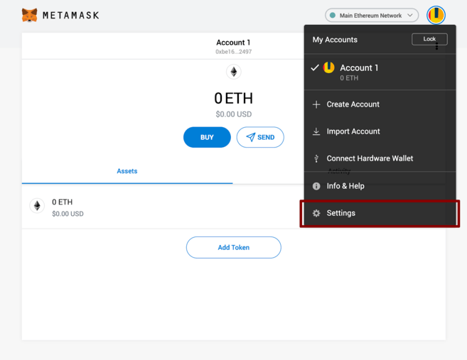

MetaMask 可以通过 Chrome 和 Firefox 浏览器下载，移动端支持 iOS 和 Android 平台。在本教程中，我们将使用 Firefox 版本进行演示，不同平台的流程大致相同。

首先，请跳转至 MetaMask [下载](https://metamask.io/download.html)页面。选择您使用的平台，然后按以下步骤在设备中安装 MetaMask。

接下来，按照 App 指定的设置进行操作。点击"创建钱包”（ Create a Wallet）。在私密性较强的设备（最好是与网络断连的设备）中输入备份的助记词（seed phrase）。如果没有妥善存储助记词，在设备损坏或丢失时，很可能无法找回资金。因此，请在下一页确认已将助记词写下并妥善保管。

## 配置钱包

默认情况下 Metamask 连接的是 ETH 的主网，我们需要对设置进行调整。访问“设置”（Settings）页面，将钱包指向 MVM 节点。

在下拉菜单中选择“设置”（Settings）。

在设置页面中，找到“网络”（Networks）菜单。

点击右上角的“添加网络”（Add Networks），我们需要在这里手动添加 MVM 主网络

- 网络名称（Network Name）：Quorum Test
- 新的 RPC URL（New RPC URL）：[https://quorum-testnet.mixin.zone/](https://quorum-testnet.mixin.zone/)
- 智能链 ID（ChainID）：83927
- 符号（Symbol）：RUM
- 区块浏览器 URL（Block Explorer URL）：[https://testnet.mvmscan.com/](https://testnet.mvmscan.com/)

也可以通过 [https://chainlist.org/](https://chainlist.org/) 来一键添加。

在保存（Save）网络并返回主页面后, 就可以正常的转账，调用 web3js 来部署合约了。
