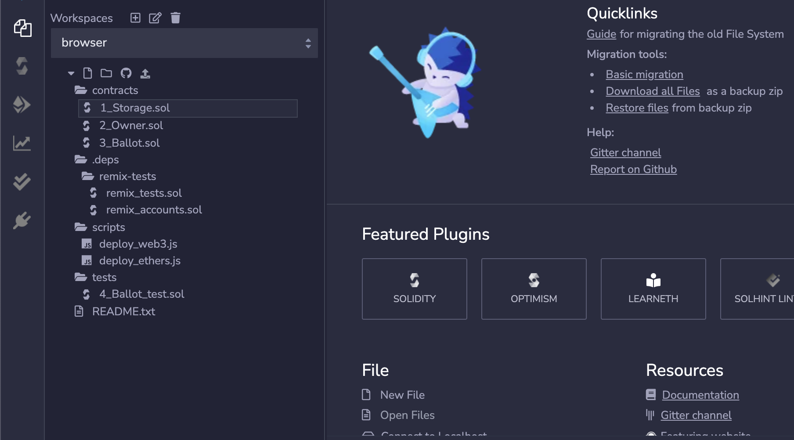
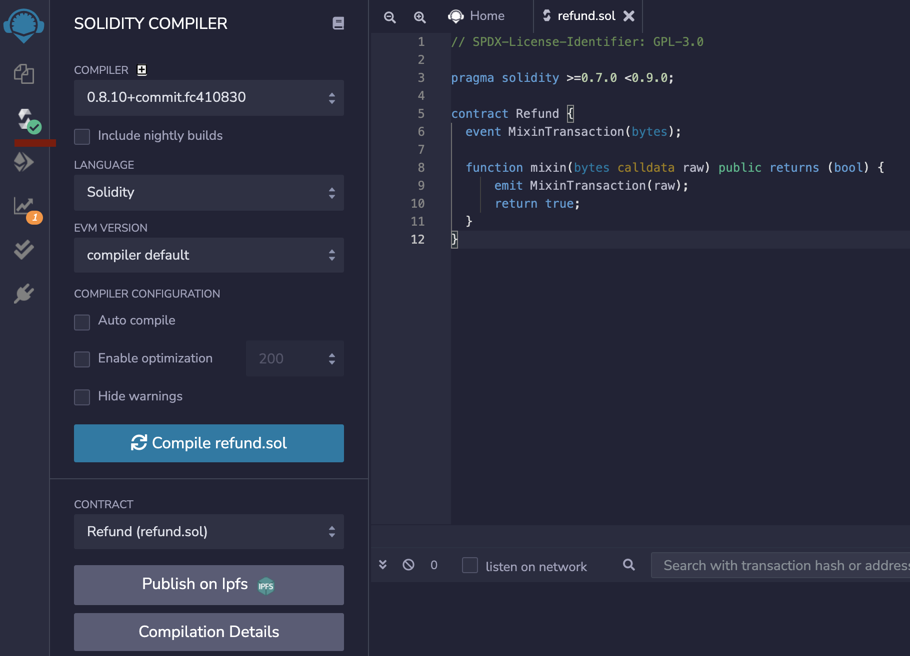
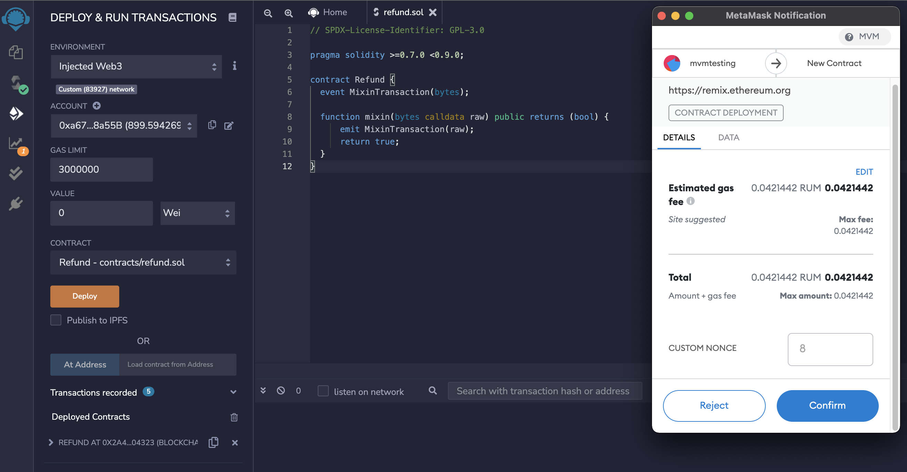

输入 <https://remix.ethereum.org/> 打开 Remix。在主画面中，点击 Environments，选取 Solidity 配置 Remix 来 进行 Solidity 的开发，最后打开 File Explorers 的画面，如下图所示：



我们需要创建一个新的文件夹来储存 Solidity 智能合约。点击 File Explorers 下面的 “+” 按钮，接着在弹窗内输入 "refund.sol"：

并且写入以下内容:

```solidity
// SPDX-License-Identifier: GPL-3.0

pragma solidity >=0.7.0 <0.9.0;

contract Refund {
  event MixinTransaction(bytes);

  function mixin(bytes calldata raw) public returns (bool) {
      emit MixinTransaction(raw);
      return true;
  }
}
```


接下来，在编辑器侧边选项，选择并点击“Compile refund.sol” 按钮：



现在我们可以通过侧边的 Deployment 选项来部署合约。您需要将顶端的 "Environment" 从 "JavaScript VM" 向下拉至 "Injected Web3 "。如此一来，Remix会使用MetaMask导入的账户并指向一个已导入的 MVM 独立节点。



部署完成后, 就可以在 Metamask 查看该合约的详情


例如:
<https://testnet.mvmscan.com/tx/0x1938e2332d7963eff041af4f67586572899c7c7d279c07ac29feb745f8d9b6d6/internal-transactions>

这里拿到的合约地址是 0x2a4630550ad909b90aacd82b5f65e33affa04323, 需要点进合约，拿到大小写区分的地址，例如: 0x2A4630550Ad909B90aAcD82b5f65E33afFA04323
