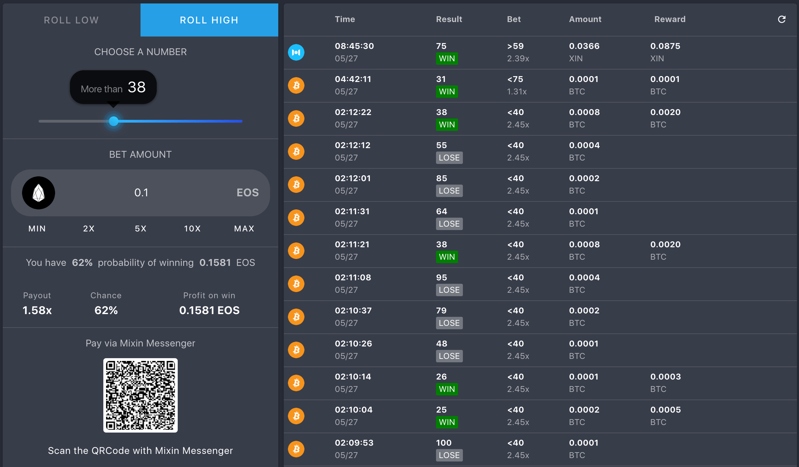

### Introduction
DICEOS is developed based on Mixin, and now supports BTC, EOS, BOX, XIN, ETH, DOGE betting, beautiful interface, friendly interactive experience, fair and verifiable games, and many users.



### Fairness
DICEOS uses a provably fair cryptographic system which means you don’t need to trust us blindly, each roll is cryptographically fair and can be easily verified.


### Randomization
DICEOS uses the snapshot Id of the Mixin Network's transaction to generate bet result.

A snapshot Id is a standard UUID string, which is randomly generated. You can find it by tapping the result text (WIN or LOSE button).

### Verify
The following code example can be used to verify a bet:
```
function verify (msg) {
  let digits = sha512.array(msg)
  let s = sum(digits)
  return s MOD 100 + 1
}
```

### Experience
Download and install http://mixin.one/messenger Mixin Messenger and log in. 
- Search ID 7000101571 to find the Diceos bot.
- Official website https://diceos.com/
