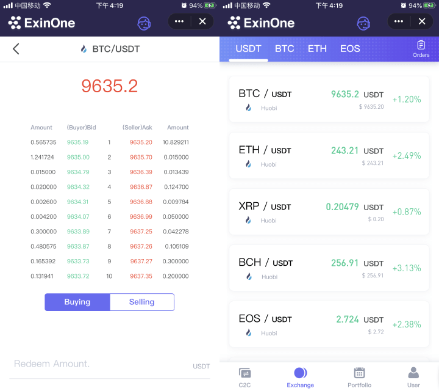
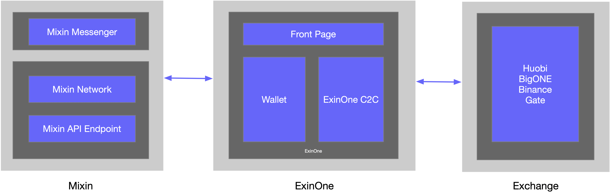

### Introduction

ExinOne is committed to providing secure financial services for digital assets and a superior user experience for users worldwide. With ExinOne, users can trade and use the service conveniently while ensuring 100% control of their assets. This article will focus on the implementation and transaction process of the C2C part.

### ExinOne C2C Advantage

- C2C functionality aggregates multiple exchanges around the world, providing greater trading depth and liquidity.
- Can carry a large volume of transactions, quickly switch trading pairs, at any time to deal with various unexpected situations to ensure stability.
- Decentralized transactions, no user assets in escrowed, fast cryptos releasing and no asset security risks.
- The best companion for the cryptos user, which the acceptor funds isolation, all-day security guard, convenient transaction and no frozen card.

### ExinOne C2C architecture

The data layer primarily uses MySQL persistent storage, Redis-assisted caching.

The core part of the business logic layer is mainly built using Laravel, and Node.js is used to implement some of the functions such as message notification, chain transfer, etc.

The presentation layer is mainly for mobile, which is a single-page application that mainly uses Vue with routing, style library and other dependencies.

### ExinOne C2C Transaction Realization

ExinOne's C2C functionality is comprised of a "**Trade pair to trade**" section and a "**Acceptor trade**" section.

For example, user buy BTC, first buy USDT from an acceptor, then connects to an exchange, exchange with BTC/USDT pair, and passes the BTC to the user.

The overall design of ExinOne makes buying and selling free, two-way transactions, quick and easy, while ExinOne is built with professional KYC and fraud prevention systems and is committed to regulatory and legal compliance.

### ExinOne Funding Pool

Just imagine, if the USDT released by the acceptor is withdrawn directly to the exchange and then directly withdrawn from the specific blockchain to the user's wallet after the transaction, it would not only require multiple fees, but also a very long chain transfer process.

To ensure timeliness, ExinOne needs to have a sufficient number of cryptos in both the Mixin wallet and the exchange as a "**funding pool**".

With the funding pool as the intermediary, only the amount of USDT purchased by the user from the acceptor, the USDT in the **Exchange funding Pool** will be used to initiate the transaction, and the transaction result will be obtained after the transaction is successful, and then transferred from the **Mixin funding Pool** to the user, thus achieving a very fast transaction.

It is because of Mixin Network's internal transfer "**fast and no fees**" that the advantages of the pooling strategy can be leveraged, greatly increasing the speed of transaction, reducing the cost of fees, lowering the threshold of cryptos users transactions, and enabling users to enjoy a silky smooth experience.

### ExinOne C2C process

Let's take the example of buying 1000 CNY of BTC, currently C2C buys BTC using Huobi's BTC/USDT trading pair.

When placing an order, the system will automatically match the corresponding acceptor to the user based on the "Intelligent Acceptor Allocation System" and display the acceptor's collection account with reference to the payment method and amount of the order.

Users transfer money through WeChat, Alipay and bank cards, and after confirming the transfer, the system notifies the acceptor to check the account.

After confirming the payment, the acceptor releases approximately 141.24 USDT equivalent to 1000 CNY and buys the market price of 141.24 USDT from the Huobi pool to the BTC/USDT trading pair via API.

Upon completion of the transaction, the proceeds are deducted from the Mixin pool and transferred to the user's designated wallet, based on the results of the transaction.

The entire buying process only takes 3-5 minutes on average, the average time for merchants to release cryptos after the user pays is less than 60 seconds, and the average time for merchants to transfer orders after selling is around 60-180 seconds.

### Experience

- Download and install [http://mixin.one/messenger](http://mixin.one/messenger) Mixin Messenger and log in
- Search 7000101276 to find ExinOne to start trading

### Contact Us

I'm ExinOne Mia and welcome to contact me via Mixin Messenger with my Mixin ID: [37027482](https://mixin.one/codes/4785d612-8262-41ef-9ec2-e2318a2b3f3e).