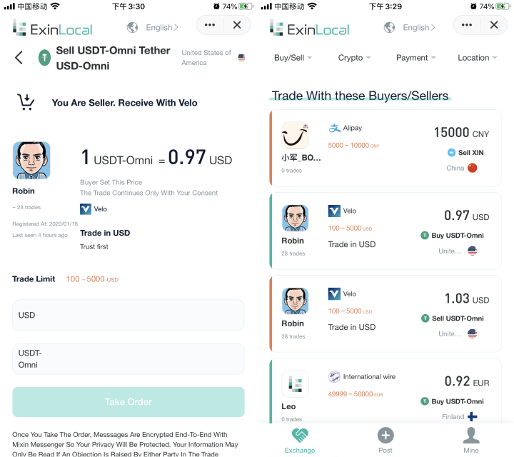

### Introduction

**ExinLocal is a worldwide peer-to-peer marketplace where buy and sell cryptocurrencies**. Buyers and sellers advertise on ExinLocal to trade cryptocurrencies through multiple payment methods. When a user responds to an advertisement, there is a direct reciprocal exchange between the buyer and seller. ExinLocal is based on the Mixin Network and Mixin Messenger. ExinLocal uses multi-signature feature of Mixin Network to secure funds and end-to-end encryption of Mixin Messenger to protect user's privacy.

### Architecture.

Vue is used on the frontend, Laravel is developed on the backend, blockchain and other specific features are supported by Mixin, and the product representation is a mobile-adapted web application.

### Process

OTC tradings of ExinLocal is P2P, that is to say peer-to-peer, and there are also similar products like [LocalCryptos](https://localcryptos.com), [LocalBitcoins](https://localbitcoins.com), [Paxful](https://paxful.com), etc.

ExinLocal's trading process: Assume A is the seller, B is the buyer, and the cryptocurrency of the trading is BTC. A list an ad in the ExinLocal, B finds the ad on the homepage, and initiates the trading, the ExinLocal bot creates a multi-signature wallet owned by the bot, A and B, and initiates a group chat in Mixin Messenger. A initiates escrowing according to the group chat prompt and transfers the corresponding amount of crytocurrency to the multi-signature wallet, and when the BTC is successfully transferred to the multi-signature wallet, the escrowing is successful, and B is prompted that A is escrowing the cryptocurrency and directs A to send the payment method to B. After B successfully pays the money to A according to the prompt, A is notified by clicking "I have paid" to confirm the payment. A signs the transaction to release the BTC to B. At this point, B successfully receives the BTC, and in this process, the bot only creates the multi-signature wallet, directs the user to transfer the cryptocurrency to the multi-signature wallet and signs when A agrees to transfer the BTC to B.

### Trust

ExinLocal uses multiple signatures to settle trust issues, with buyer, seller and ExinLocal participating in multiple signatures, where assets can be transferred by mutual consent. Usually, ExinLocal uses multiple signatures as guarantors for offline matchmaking, so the buyer doesn't have to worry about not receiving cryptocurrency and the seller doesn't have to worry about not receiving money. For example, if A escrow the BTC but B does not pay A the amount of the BTC, but clicks "I have paid", A can tell B that he has not received the money, and if B insists that he has paid, he can contact customer service to resolve the dispute. For example, if user A initiates escrowing and B does not respond for a long time, A can contact customer service to return to escrow and A can sign once to retrieve the escrowed BTC.

### Privacy

ExinLocal maximizes protecting user's privacy.

- End-to-end encrypted group chat ensures that any third party cannot access the content exchanged between users
- No escrow of user's funds, they have absolute control over the funds
- Do not store any sensitive information, including payment method
- No authentication of mobile phone number, only as a backup contact in case the user cannot be reached

### Sorting

ExinLocal homepage displays the ads posted by the user, the number of valid orders, favorable rating, trading amount will affect the ranking, more valid orders, higher favorable rating, higher trading amount, will get more homepage display opportunities.

### Experience

- Download and install [http://mixin.one/messenger](http://mixin.one/messenge) Mixin Messenger and log in
- Search **7000000015** to find ExinLocal and start trading

### Reference.

- [Little things about multiple-sign](https://w3c.group/c/1581363093875579)
- [Why ExinLocal](https://w3c.group/c/1587127323846677)
- [ExinLocal OTC Trading Tutorial](https://w3c.group/c/1588079774302618)

***

I'm ExinLocal Robin, welcome to contact me via Mixin Messenger, my Mixin ID: [26930](https://mixin.one/codes/89f7e832-ff53-4fff-ad47-10c68ec96ae2).

