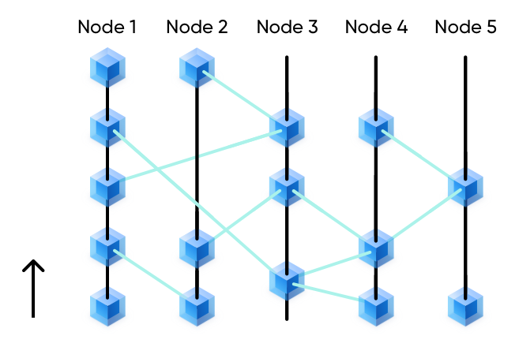

# Full Node
As the Bitcoin network, Ethereum, and other public chains, Mixin is also an open, permissionless network where anyone can become a full node. There is no election, and the only requirement is to pledge 2% of the tokens in circulation the previous year.

### Recommended configuration
- __Memeory__ 64G
- __CPU__ 16 core
- __Storage__ 1T SSD(SSD is indispensable)
- __Bandwidth__ No requirement for now

### Node Count
The limited number of nodes is one of the key factors for high performance. Mixin network supports up to 50 full nodes, and at least 7 nodes are required.

  ### Node Bookkeeping
  The chief job of full nodes is bookkeeping, which is verifying and recording every transaction in the Mixin network.

- Every transaction needs to reference a record of this node and other nodes, and the referenced height must be increasing

  

- The order in which each node records transactions may be different, to realize asynchronous and concurrent processing of transactions. It can be understood that each node is an independent blockchain

  

## Asset Management
When the assets managed by the Domain exceed its collateral, the assets will be forcibly transferred to the multi-signature cold wallet address jointly managed by the mainnet nodes.

## Node Rewards
90% of 10% of all leftover mining pool tokens from last year will be given to full nodes(10% for light nodes). The distribution cycle is once a day, the nodes are distributed equally. Currently, the daily income of each node is 110.95890408 XIN / 35 nodes = 3.1702544 XIN.

### Punishment Of Evil
If a full node commits evil, such as broadcasting an obvious double-spending transaction, it will be marked as a potential attacker. Once a full node is confirmed as an attacker, all its collateral will be recycled into the mining pool and it will be kicked out of the node network.

When a node launches an attack for the first time, its rights and interests won't be revoked immediately, but it will be marked as a potential attacker. The number of kernel consensus nodes will temporarily decrease by 1. Note that this decrease is invisible to potential attackers. If the potentially attacking node continues to broadcast illegal transactions, the kernel will mark the node and the collateral of the node will be transferred to the mining pool. The marked node can appeal within a period.

## Join As Mixin Full Node

[Full Node Joining Guide](../tutorials/full-node-join)
