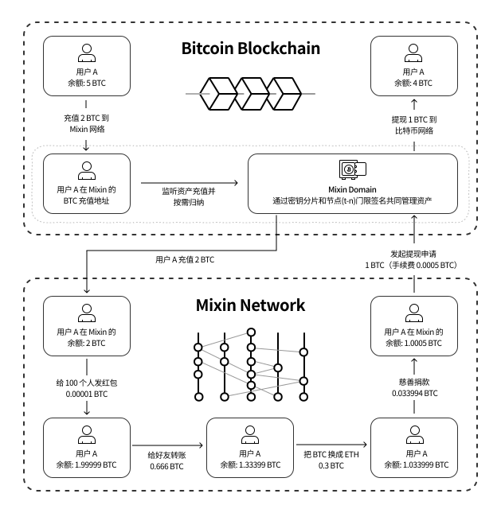

# How it Works

Mixin is a free, lightning-fast peer-to-peer cross-chain trading network for digital assets. Through the Domain gateway, Bitcoin, Ethereum, Monero, and a lot more popular public chain assets are brought into Mixin network. All the off-chain transactions are recorded in a public transparent Mixin distributed ledger and written to the blockchain when withdrawals happen.

### Distributed Ledger

Mixin's distributed ledger is an open and transparent decentralized ledger, which is collectively booked and maintained by 35 mainnet nodes. All deposits, withdrawals, and transfers are recorded on this decentralized distributed ledger, and each record contains asset type (such as Bitcoin, Ethereum, etc.), transfer amount, and other information.

- Nodes
 
  Each mainnet node needs to pledge 11,000 XIN (2% of the circulation) to participate in bookkeeping. If it is identified as an attacker, e.g. intentionally broadcasting obvious double-spending transactions, the collateral will be confiscated into the mining pool.

  Mixin utilizes Intel SGX as the implementation of TEE to further improve security. All mainnet nodes must run in a trusted execution environment to ensure that the "running code" of the mainnet node is indeed "the code it claims to be running". Nobody can change the running code in the trusted execution environment without being noticed.

  SPV light nodes supervise the main network nodes to prevent evil. Any user who pledges an integer multiple of 0.1 XIN can participate. By recording their UTXO changes and the topology order of the nodes, they can detect whether the nodes are evil.

  

- DAG

  Mixin uses DAG as the underlying data structure model. Unlike other public DAG chains (such as IOTA, Bytaball, etc.), Mixin does not have a central authority node, and data does not need to wait for the final confirmation from the central authority node. By limiting the time of referencing data and other mechanisms, asynchronous and efficient operations can be achieved, and the correctness of consensus results is ensured through Asynchronous Byzantine Algorithm. To put it simply, each node of Mixin is a chain with complete data, even though the order of the data may be different, the same result can be derived in the end.
 
- Privacy

  UTXO transaction privacy is strengthened through CryptoNote technology. Only both parties know the transaction, and mainnet nodes cannot know the parties to the transaction, and it is impossible to get the identities of parties to the transaction based on the transaction itself.

  **Note that Mixin does not have a currency issuance function and will not generate assets out of thin air. Mainnet tokens have always been ERC-20 tokens.**

### Asset Management

- Domain Gateway

  The Mixin Domain plays an important role as a gateway in Mixin Network, managing the deposits and withdrawals of on-chain assets. Unlike mainnet nodes that do not require permission, a Domain gateway needs to pledge a large amount of XIN, and only be able to join when the unanimous consent of all nodes is granted. As the amount of assets increases, there will be multiple domains to decentralize the management of assets. The existing Domain is managed by the Mixin team with 50,000 XIN pledged(referred to as "The Domain" in the following).

  The Domain does not have the complete private key of an on-chain asset (such as the Bitcoin private key). The private key is kept by nodes and the Domain through key sharding technology. Key shards have multiple backups, so the key will not be lost even some of the backups are lost or leaked. When the user withdraws, mainnet nodes and the Domain separately sign the transaction through (t-n) threshold signature technology, and finally merge everything into a complete signature and send the transaction.

- Mainnet Cold Wallet

  When the assets managed by the Domain gateway significantly exceed the value of its collateral, the assets of the Domain will be forcibly transferred to the cold wallet address jointly managed by 35 nodes.

### Transaction Bookkeeping

Once the assets are in the Mixin network, you can immediately enjoy the experience of free and real-time transactions. For the original chain (such as the Bitcoin network), the transactions are off-chain, but they are recorded in the decentralized ledger of Mixin, open, transparent, and irreversible.

- Deposit

  Each user generates a unique deposit address (or distinguished by Tag/Memo), but the private key of the address is managed by the Domain and collected on demand, and the collected assets are jointly managed by mainnet nodes and the Domain.

  When the Domain detects a user's deposit and the deposit has reached the required confirmations, it will initiate a transaction containing the user's deposit information to the nodes. After the nodes confirm the transaction, the user will own a new unspent UTXO (asset balance increase) and the transaction will also be recorded in the distributed ledger.

- Transfer

  When a user transfers, a multi-signature transaction will be generated through the 6-digit password + PIN node private key seed and sent to the mainnet nodes. The transaction will reference the historical transactions of the user's node and other nodes. The mainnet nodes will verify the user’s signature, check if there is enough unspent UTXO and other information, and the transaction will be written into the distributed ledger after more than 2/3 + 1 nodes have verified it.

  

- withdrawal

  When a user initiates a withdrawal, the user needs to add a withdrawal address. The process is similar to the transfer process and will be written into the distributed ledger. When the Domain detected the transaction and signature of the mainnet node withdrawal, it will automatically arrange the withdrawal after the transaction and signature are verified. (No manual review).

  If the withdrawal is delayed, besides wrong address, another reason could be that the withdrawal transaction may not be sent due to the Domain failing to synchronize node data (you can subscribe to bot 7000101498 and will receive a failure alarm), or that the assets of the co-managed address are not enough so the collection of temporary assets is triggered, in this case, all it takes is to wait a moment or two.

### FAQ

- What is the relationship between Mixin, Mixin Network, and Mixin Messenger?
  
  Mixin is short for Mixin Network, and Mixin Messenger is the first open-source Dapp on Mixin Network. Due to historical reasons, Mixin was considered Mixin Messenger for a long time.

- Why does Mixin only allow login via phone number?

  Mixin Messenger is a Dapp product that only allows login via phone numbers, but other Mixin Network-based products can be logged in by email or Apple Id, etc., it depends on the products themselves, such as [Poolin Wallet](http://poolin.fi).  

- Why aren't airdrops supported? Why can't I get the balance of the BTC deposit address in my wallet with a blockchain browser?

  The deposit and withdrawal of Mixin do not use the same address. After the user deposits, the assets will be transferred to the address jointly managed by the Domain gateway and the nodes. More than 2/3 + 1 nodes need to verify and sign before withdrawing from the co-managed address to a target address. Therefore all deposit addresses are empty, and the balance cannot be checked and airdrops based on the balance cannot be accepted.
  
- Why aren't the BTC withdrawal addresses managed by the Domain multi-signature addresses?

  Because Bitcoin multi-signature can only support more than a dozen people and cannot support 35 nodes to do multi-signature. Even though Mixin's withdrawal address is an ordinary address, the private key is based on cryptographic key sharding and (t, n) threshold signatures, so the result is equally safe and reliable.

- Where is the Mixin blockchain browser?

  Blockchair, third party, https://blockchair.com/mixin

  Mixin core team, https://mixin.one/snapshots
