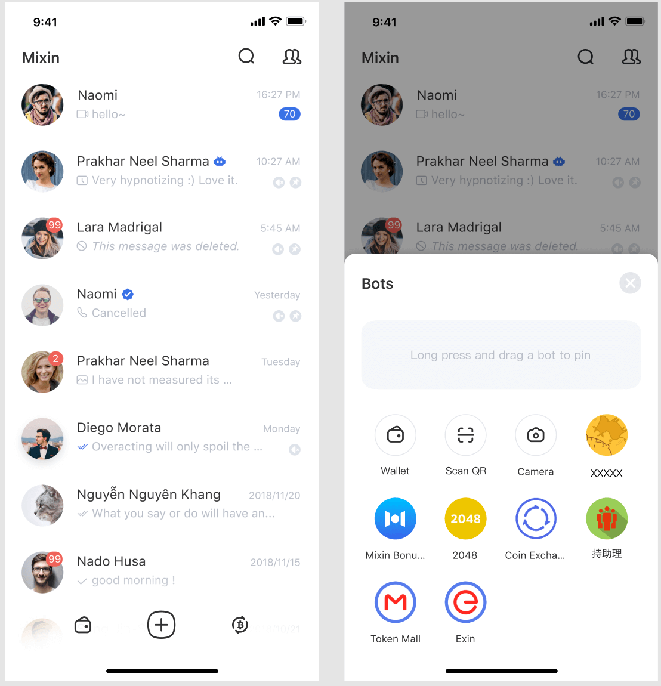

 

Mixin Messenger has supported to pin the bot on the home page since the version 0.24.0, and all bots could be pinned on the navigation bar at the bottom of the home page. This improvement is significant. The right to edit the navigation bar is directly given to the user, leaving the opportunity of the first-level entrance to the bot developers. Users can put their favorite and most commonly used bots to the home page, and the bots as a first-level entrance will also get more frequency and duration of use.

#### Function description
- All added bots are displayed on the home page, the button "+" pops up the bot list, and bots are no longer displayed in the contact list.
- The pop-up window of the bots list on the home page allows editing the top 4 commonly used bots by long-press and drag icons. The first 2 topped bots will be displayed on the menu at the bottom of the home page, and the menu at the bottom of the home page will display the icon corresponding to the bot category (the bot developers, please update the category corresponding to your bot on time.) When the topped bots are full, need to drag and remove the bot and then add new ones.
- Wallet, QR code scanner, and camera will be used as built-in bots. Wallets and camera icon will be set on the top by default, and users can replace them at will.
- The bots are sorted by name by default, and the built-in bots are always at the top.

#### Recommendations for developers:
Want your bot topped on the home page by users? In addition to meeting the users' functional needs, better user experience is also an important reason for users' favor, so come and optimize:
- Optimize interaction design and enhance user experience.
- Make full use of caches and use offline cache techniques such as PWA.
- Optimize access speed in seconds to make it closer to the native experience