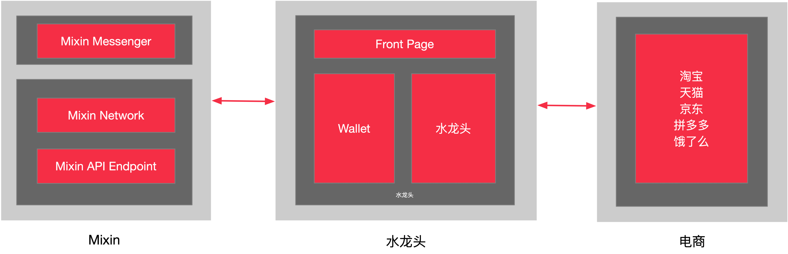

### 简介

水龙头 App 是第一个通过网购就能轻松获得比特币奖励的平台，我们已经接入淘宝、天猫、京东、拼多多、饿了么等电商平台，后续会接入更多的平台，推动它们在线上的销售。

通过水龙头 App 进行搜索后，只要从水龙头跳转到已经支持的电商平台上完成网购，就能获得来自相应的电商平台的佣金，而我们会将这些佣金兑换成相应的比特币奖励给用户。

### 奖励渠道

- 电商购物
- 外卖
- 区块链学习平台（即将支持）

### 系统架构

前端使用 Vue，后端使用 Laravel 开发，区块链及其他特定功能由 Mixin 提供支持，产品形态是移动端 App 应用。本应用大量使用了 **Mixin Network** 提供的接口来实现 BTC 价格的获取、BTC 转账秒到等功能。

### 超级搜索

搜索方式包括：商品链接搜索、商品标题搜索、关键字搜索、淘口令搜索。超级搜索先是根据输入的内容来判断是哪个平台的分享，再从相应的平台中搜索商品，从中分析处理得到相应的返佣商品再呈现给用户。

### 邀请奖励

水龙头 App 为每个用户生成了专属邀请海报和邀请链接，通过您的邀请海报或邀请链接注册成功并完成下单的用户，您可以获得相应比例的比特币奖励。奖励分一级奖励和二级奖励，一级奖励最高 20%，二级奖励最高 5%。

### 奖励结算

水龙头每分钟都会从相应的购物平台中获取用户的新订单，以便能在用户下单之后第一时间能利用 **Mixin Network** 给用户反馈订单的奖励情况。在每天定时的订单抓取下及时更新用户的订单状态，从已付款、到已收货，到最后的购物平台最终确认的已结算，水龙头会在 21 号对购物平台返回的订单状态已结算的订单进行账单统计，再通过从 Mixin Network 获取的 BTC 价格统一为用户结算相对数量的 BTC。

### 奖励提现

绑定 Mixin Messenger 后比特币奖励可自动提现至 Mixin 钱包，0 手续费。后续会继续利用 Mixin Network 支持将 BTC 提现至任意比特币地址，除了 Mixin Network 上的地址，其他地址会有一定的手续费作为链上转账的消耗。

### 产品体验
- 各大应用市场搜索「水龙头」或「ExinEarn」;
- 通过链接下载：[https://app.exinearn.com/download](https://app.exinearn.com/download)；
- 在 Mixin Messenger 中搜索 7000000014 名称为「水龙头 App」。

----

我是水龙头 Penn，欢迎通过 Mixin Messenger 与我联系，我的 Mixin ID：[37394504](https://mixin.one/codes/953dc855-f04b-44ab-8191-1556a247bce9)。

