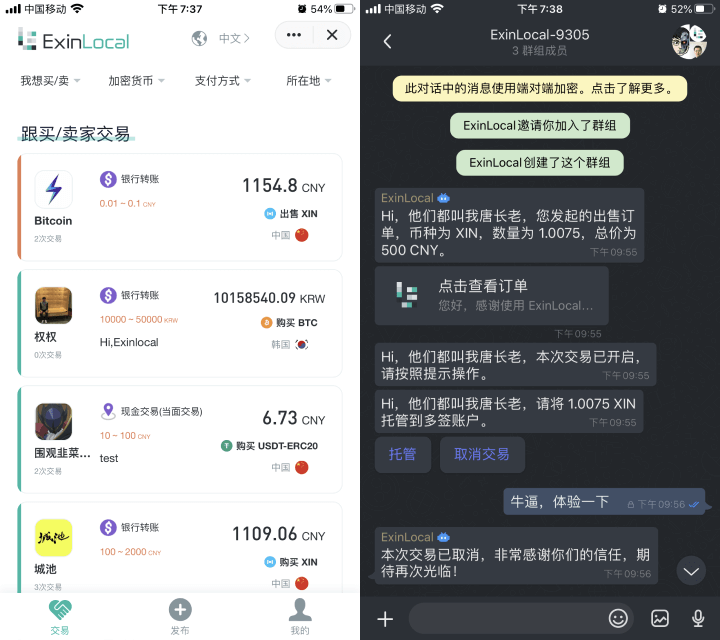
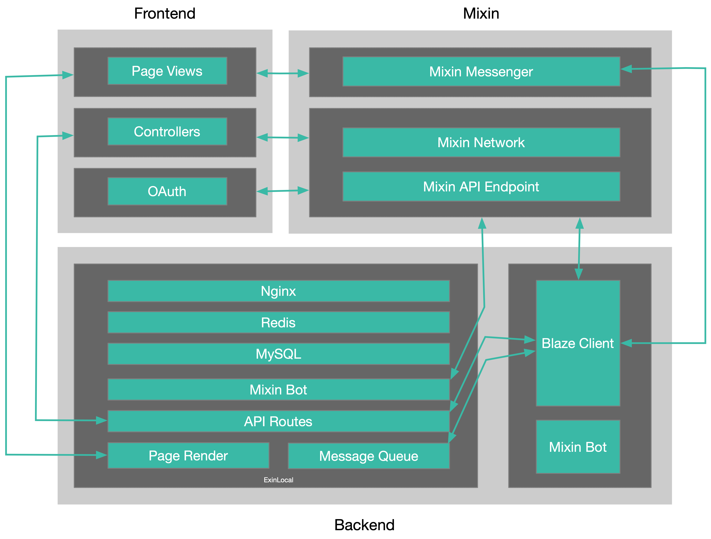

### ExinLocal 简介

**ExinLocal 是一个全球买卖加密货币的点对点市场**。买卖双方在 ExinLocal 上发布广告，通过多种付款方式交易加密货币。当用户响应广告时，买方和卖方之间直接进行对等交换。ExinLocal 基于 Mixin Network 和 Mixin Messenger。ExinLocal 使用 Mixin Network 的多签功能保障资金的安全，使用 Mixin Messenger 的端对端加密保障用户的隐私。

### 架构
前端使用 Vue，后端使用 Laravel 开发，区块链及其他特定功能由 Mixin 提供支持，产品形态是移动端适配的 Web 应用。

### 流程

ExinLocal 的 OTC 交易是 P2P 的，也就是 peer-to-peer。同类产品还有 [LocalCryptos](https://localcryptos.com)、[LocalBitcoins](https://localbitcoins.com)、[Paxful](https://paxful.com) 等。

ExinLocal 的交易流程：假设 A 是卖方，B 是买方，交易币种为 BTC。A 发布交易广告，B 在首页找到该信息，然后发起交易，ExinLocal 机器人会创建一个由机器人、A、B 三方共同拥有的多签钱包 ，同时发起群聊。 A 根据群聊提示发起托管，将对应数量的币种转入多签钱包。BTC 转入多签钱包成功后，即托管成功，便立即向 B 提示 A 已托管，并同时引导 A 将收款方式发给 B，B 根据提示成功将款项支付给 A 后，点击「我已付款」的同时会通知到 A ，让 A 确认收款，即签名同意将 BTC 释放给 B。此时 B 就能成功收到这笔 BTC。该过程中，机器人只起到创建多签钱包，引导用户将币转到多签钱包以及在 A 同意将这笔 BTC 转给 B 的时候进行签名的作用。

### 信任
ExinLocal 采用多签解决信任的问题，买家、卖家和 ExinLocal 共同参与多签，其中两方同意即可转移资产。通常线下的撮合，有担保人的角色，ExinLocal 采用多签充当担保人，买方不用担心收不到币，卖方不用担心收不到钱。用户双方无须担心对方有使诈欺骗的空间，例如，A 托管了 BTC，但 B 并没有给 A 支付这笔 BTC 的金额，却点击了「我已付款」，此时 A 完全可以向 B 表示还没收到钱，如若 B 坚持已经支付，可以联系客服解决纠纷。再例如，用户 A 发起托管后，B 长时间不响应，A 可以联系客服，返回托管，A 签名一次就可以取回托管的 BTC。

### 隐私
ExinLocal 最大化保障用户的隐私：
- 端对端加密的群聊确保任何第三方无法获取到用户之间交流的内容
- 不托管用户交易资金，用户对资金有绝对地控制权
- 不存储包括收款方式的任何敏感信息
- 不验证授权的手机号，仅在无法联系用户时作为备用的联系方式

### 排序
ExinLocal 首页展示用户发布的交易广告，用户的有效订单数、好评率、交易额将会影响排序，更多的有效订单、更高的好评率、更高的交易额，将会获得更多的首页展示机会。

### 体验
- 下载安装 http://mixin.one/messenger Mixin Messenger 并登录
- 搜索 7000000015 找到 ExinLocal 机器人开始使用

### 参考
- [多签那些小事](https://w3c.group/c/1581363093875579)
- [为什么选择 ExinLocal](https://w3c.group/c/1587127323846677)
- [ExinLocal OTC 交易教程](https://w3c.group/c/1588079774302618)

***
我是 ExinLocal Robin，欢迎通过 Mixin Messenger 与我联系，我的 Mixin ID：26930。

