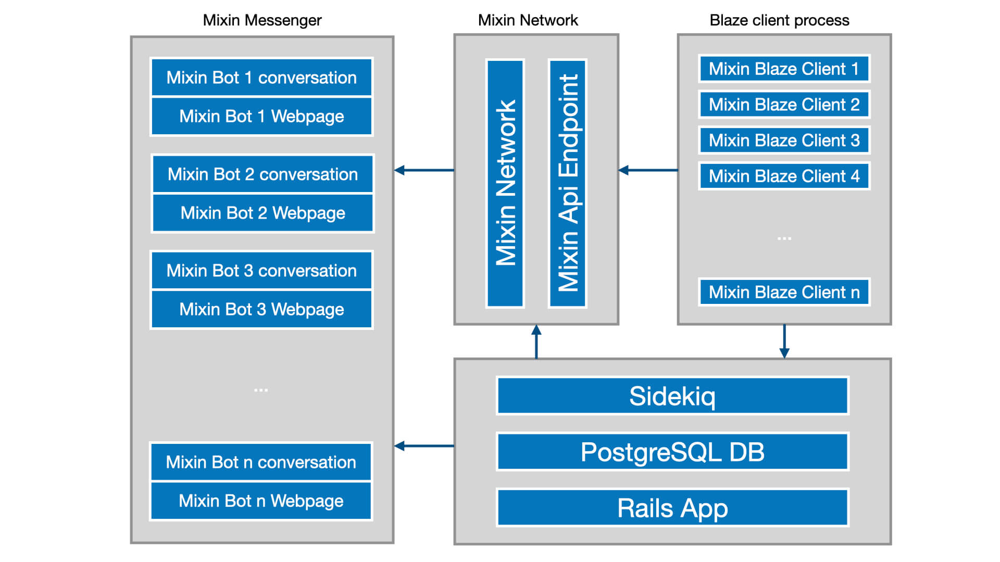

### 我信简介
我信 https://ohmy.xin 是基于 Mixin Messenger 建立的托管 Mixin 机器人的 SaaS 服务平台。通过我信平台，用户可以非常容易地上线一个具备各种功能的标准化 Mixin 机器人。

### 我信架构

### 机器人托管

用户向 我信 提供 Mixin 机器人的相关密钥后，即可将机器人托管至我信平台。我信将会为每一个托管成功的 Mixin 机器人创建一个 websocket 线程，实时监听机器人收到的消息并做相应的处理。同时，根据业务需要，可以调用 Mixin 的 API，通过机器人向其他用户发送消息。

### 我信圈子

我信的服务本质上是为用户托管 Mixin 机器人并提供标准化的机器人功能。我信圈子，就是我信机器人托管服务其中一种标准化机器人。

基于 Mixin 的转账服务，机器人可以收取各种加密货币作为入圈的费用。

在机器人的主页内，我信为每个机器人实现了一个私密的社交空间，提供了常见的社交化功能，例如发帖、评论、点赞、打赏、分享等。

基于机器人的消息服务，我信为每个机器人实现了消息广播、圈内群聊等功能，为圈主与成员之间创建了一种独特而灵活的交流方式。

### 体验
下载安装 http://mixin.one/messenger Mixin Messenger 并登录
- 搜索 7000101526 找到 我信 机器人开始使用
- 访问网站  https://ohmy.xin

### 联系方式
开发者 Mixin ID: 1051445