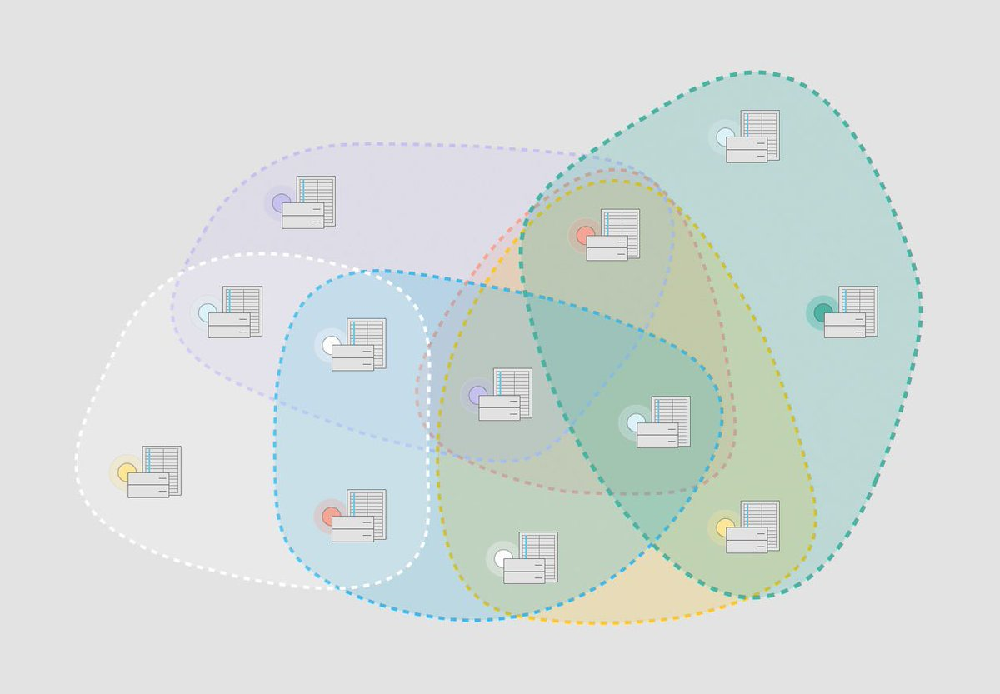

# MobileCoin

MobileCoin 是一个隐私支付协议，专注于为移动通讯应用程序提供安全、隐私、极简的加密货币钱包服务。

### 基本信息

- 项目官网：https://www.mobilecoin.com
- 主网上线：2020 年 12 月 7 日
- 代币总量：250,000,000 MOB
- 共识机制：MobileCoin 共识协议（恒星共识协议修改版）
- 主网语言：Rust
- 最小单位：1 picomob = 0.000000000001 MOB（精度小数点后 12 位）
- 私募预售：37,500,000 MOB

### 公链特点

- 易于恢复
  
  如果用户丢失了手机，无需信任私钥提供商就能安全的恢复钱包。

- 快速转账
  
  大多数交易将在 1 秒内完成，尽享支付的乐趣。

- 高度隐私
  
  完全隐私不透明的分布式账本，每个交易都受到密码保护并且向前保密，任何信息服务商或其他第三⽅都⽆法获取⽤户余额、交易历史、转账金额、转账发送方和接收方等隐私信息。

- 用户友好
  
  易于大规模安全使用，不会消耗过多的能源，而且能够自由的在集成了 MobileCoin Procotol 的 App 之间相互转账，例如 Signal 的用户能够方便的给 WhatsApp 的用户转账。

### 核心技术

- MobileCoin 共识协议（恒星共识协议修改版）
  
  MobileCoin 共识协议基于恒星共识协议（Stellar Consensus Protocol）修改而来。MobileCoin 没有中央授权，参与节点可以是个人、企业或者是组织，但是他们之间必须真实的信任关系，用户可以选择自己信任的一组节点提供服务。例如 Blockdaemon 加入了 MobileCoin 基金会，那么 MobileCoin 可以选择信任 Blockdaemon 的节点，这样两个节点之间就能建立连接，而 Blockdaemon 和 MobileCoin 同时可以选择信任更多节点，更多节点又能去信任更多节点，以此类推可建立一个庞大但性能又非常高的分片网络。
  
  
  
  MobileCoin 共识协议相比 PoW 具备更低的能耗和更高的效率，相比 PoS 越富越有控制权，MobileCoin 获得用户信任越多越有控制权。

- 分布式账本
  
  MobileCoin 区块链是一种零知识的数据结构，由 UTXO、密钥镜像（key images）和用于确保一致性和结构的 Merkle 证明的元数据块组成。
  
  每个区块都包含可供未来花费的 UTXO，每笔交易都包含了未花费的 UTXO 输出和未曾被消费过的证明。MobileCoin 是基于隐私保护而设计的加密账本，使用一次性地址来掩盖所有 UTXO 所有者的身份，发送方和接收方通过环签名（RingCT）来隐藏 UTXO 中实际消费的金额。
  
  MobileCoin 的环签名（RingCT）是通过防弹证明（Bulletproofs）来实现的，防弹证明（Bulletproofs）是一种非交互式零知识证明协议，可以提高性能。只有交易的接受者才能真正知晓转账的金额，并获得新的可用于未来消费的 UTXO。
  
  交易中每一个 UTXO 都有一个包含了 MobileCoin 账本中的 Merkle 树证明，交易被添加到区块之前输入环都已被删除，数字签名被添加到分类账中以代替完整的交易记录，为审计提供基础。

- SGX 可信执行环境
  
  所有的 MobileCoin 交易都在安全的在 SGX 可信环境中验证。SGX 可信执行环境对于外界来说是一个不透明的盒子，即时拥有 SGX 硬件也无法查看里面的信息，从而可以实现将交易记录追加到区块链同时丢弃诸如环签名等识别信息。
  
  SGX 还支持一种成为“远程认证”的特性，可远程识别出节点服务器 SGX 可信执行环境中正在运行的软件及其哈希值，所有节点在建立加密连接之前先进行远程认证，具体而言可以要求节点在 SGX 环境中签名回执消息来证明。远程认证使得整个 MobileCoin 账本和代码都在可信的环境中执行，不受恶意代码攻击。

- 密钥管理
  
  在 SGX 可信执行环境中运行的 MobileCoin 节点能够为⽤户安全地管理密钥。客户端先通过远程认证安全的连接到 MobileCoin 节点，再将私钥和简短 6 位数字 PIN 码加密传输到节点，节点收到后在可信执行环境中加密保存，至此用户 + 6 位数字 PIN 码完成了对私钥的映射关系。通过这种方式用户的私钥被安全的存储在节点中，在应用被重新安装时得以恢复，无需信任节点，更不必记住没有规律无法脑记忆的恢复助记词。

- 隐私保护
  
  MobileCoin 整体设计与 Signal 一脉相承，通过密码学和技术保障数据公开不可逆又最大限度的保障了用户的隐私，真正将隐私的决定权交给用户，用户可以永远不公开交易记录，也可以自主向特定政府机构或组织提交自己的交易记录用于审计等用途。
  
  MobileCoin 通过 CryptoNote 隐藏收件人，通过环签名（Ring Signature）隐藏发件人，通过环机密交易（Ring Confidential Transactions）隐藏交易金额，并且交易上链时还删除了输入数据（只保留输出和证明）。
  
  与 Signal 消息向前保密（Forward Secrecy）一样，MobileCoin 的历史交易也无法被破解，就算极端情况例如可信执行环境的 Bug 导致被攻破也无法解密之前的历史交易。

### 节点网络

- 验证节点（Validator Node）

  所有验证节点都必须运行在开启了 SGX 可信执行环境中，否则无法与其他节点建立连接。用户在客户端构造好交易后会把交易提交到自己信任的验证节点，验证节点验证通过后会通过 MobileCoin 网络与其他节点共享该交易。每个验证节点都有一个状态机的副本，状态机使用拜占庭共识算法以确定交易顺序并添加到账本。

- 观察节点（Watcher Node）

  观察节点在 MobileCoin 网络中扮演重要角色，除了维护区块链完整本地副本，校验每个区块的签名，监控分布式网络账本的完整性，还为钱包和交易所提供可供数据查询的 API 。

### 地址

没有固定前缀，Base58 编码，例如 `5iztW1iYhGwUt2QXNwjTkGoR15QngTeT6DX524T3FogaexFmLdBiAoUdHFM6JYVdZYwCPKUCrvy9MrmGeZcSCwTPdNef7GXnSF1kZheVMwg`
