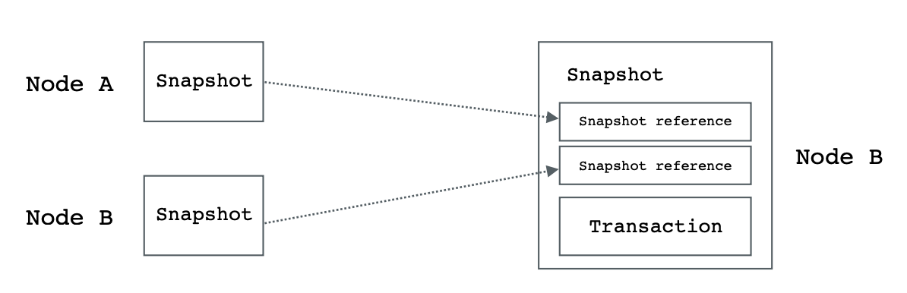

# Mixin 的工作原理

Mixin 是一个免费、快速的点对点跨链数字资产交易网络，比特币、以太坊、门罗币等众多热门公链资产通过 Domain 网关进入 Mixin 网络，所有链下交易被记录在公开透明的 Mixin 分布式账本中，提现时结算上链。

### 分布式账本

Mixin 的分布式账本是一个公开透明的去中心化账本，由 35 个主网节点共同记账和维护。所有充值、提现和转账都被记录在这个去中心化的分布式账本上，每一笔记录都包含了资产类型（例如比特币、以太坊等）、转账金额等信息。

- 节点
  
  每个主网节点需要抵押 11,000 XIN（抵押流通量的 2%）才能参与记账，如果被识别为攻击者抵押将会被回收进矿池，例如广播明显的双花交易。
  
  Mixin 使用 Intel SGX 作为 TEE 的实现来进一步提升安全性，所有主网节点都必须在可信执行环境中运行，确保主网节点 “正在运行的代码” 的确是 “它声称正在运行的代码”，没有人能够在不被察觉的情况下改变可信执行环境里正在运行的代码。
  
  SPV 轻节点可以进一步监督主网节点防止作恶，任何用户抵押 0.1 XIN 的整数倍均可参与，通过记录自己的 UTXO 变化和节点的 topology 顺序来检测节点是否作恶。

  

- DAG
  
  Mixin 采用 DAG 作为底层数据结构模型，区别于其他 DAG 公链（例如 IOTA、Bytaball 等），Mixin 没有中心权威节点，数据不需要等待中心权威节点的最终确认。通过限制引用数据的时间等机制确保异步高效运行，并通过异步拜占庭来保证共识结果的正确性。可以简单理解 Mixin 每个节点都是一条链，具备完整的数据，但数据的顺序可能不同，最终都能推导出同样的结果。

- 隐私
  
  通过 CryptoNote 技术加强 UTXO 交易隐私，交易只有双方知道，主网节点也无法知道交易双方，无法根据交易本身推导出交易具体双方。

  **注意 Mixin 没有发币功能不会凭空产生资产，主网代币一直都是 ERC-20 代币。**

### 资产管理

- Domain 网关
  
  Mixin Domain 在 Mixin Network 中担任重要的网关角色，管理链上资产的转入和流出，区别于无需许可的主网节点，Domain 网关抵押大量的 XIN 并且需要所有节点一致同意才能申请加入，随着资产规模的增加，会有多个 Domain 来分散管理资产，现有的 Domain 由 Mixin 团队抵押了 50,000 XIN 管理。
  
  Domain 没有完整链上资产的私钥（例如比特币私钥），私钥通过密钥分片技术分别由节点和 Domain 保管，密钥分片有多重备份不会丢失，就算部分丢失或者泄漏也不会影响密钥的安全性。当用户提现时，主网节点和 Domian 通过 (t-n)门限签名技术对交易分别签名，最后合成一个完整的签名将交易发出去。

- 主网冷钱包
  
  当 Domain 网关管理的资产大幅超过其抵押品的价值时，Domain 的资产将被强制转移至由 35 个节点共同管理的冷钱包地址。

### 交易记账
一旦资产充值进入 Mixin 网络仿佛进入了星际高速公路，立刻能安全的享受转账免费和秒到的超酷体验，转账相较于原链（例如比特币网络）是链下，但是又实实在在的记录了在 Mixin 公链的去中心化账本中，数据公开透明不可逆。

- 充值

  每个用户都会生成独立的充值地址（或通过 Tag/Memo 区分），但是充值地址的私钥由 Mixin Domain 统一管理并按需归集，归集的资产由主网节点和 Domain 共同管理。

  当 Domain 监听到某个用户充值并达到充值确认数时，会给节点发起包含用户充值信息的交易，待节点确认后用户会多了一个未花费的 UTXO（资产余额增加）同时交易也会记录到分布式账本中。

- 转账

  用户转账时，会通过 6 位密码 + PIN 节点私钥种子共同生成多签交易发给主网节点，交易会引用本节点的历史交易和其他节点的历史交易，主网节点会验证用户的签名、是否有足够未花费的 UTXO 等信息，待超过 2/3 + 1 节点验证通过后写入到分布式账本中。

  

- 提现
  
  当用户发起提现时，用户需要添加提现地址，具体过程和转账过程类似都会写入到分布式账本中，当 Domain 监听到主网节点提现的交易和签名时，再次校验确认后会自动安排提现（没有人工审核）。
  
  如果提现迟迟不到账除了注意地址是否正确，还可能是 Domain 同步节点数据故障导致提现交易没有发出去（可以订阅 7000101498 机器人会收到故障报警），另一种可能性是共管地址资产不够提现触发了临时资产归集，会比较慢一般等着就行了。

### FAQ

- Mixin 、Mixin Network 与 Mixin Messenger 什么关系？
  
  Mixin 是 Mixin Network 的简称，Mixin Messenger 是 Mixin Network 上第一个开源的 Dapp。由于历史原因，很长一段时间内 Mixin 被认为是 Mixin Messenger 。

- Mixin 为什么是通过手机号登录？
  
  Mixin Messenger 这个 Dapp 产品只允许通过手机号登录，但是别的基于 Mixin Network 的产品可以用邮箱或者 Apple Id 等方式登录，取决于产品本身，例如[币印钱包](http://poolin.fi)。

- 为什么不支持空投？为什么我钱包里 BTC 充值地址在区块链浏览器上查不到余额？
  
  Mixin 的充值和提现不是同一个地址，用户充值后资产会按需转移至由 Domain 网关和节点共同管理的地址，提现的时候需要超过 2/3 + 1 节点校验并签名后再从共管地址提现至目标地址，所有充值地址可能是空的查不到余额也无法根据余额接受空投。

- 由 Domain 管理 BTC 的提现地址为什么不用多签地址？
  
  因为比特币多签只能支持十几个人支持不了 35 个节点多签，Mixin 的提现地址虽然是普通地址，但是私钥是基于密码学密钥分片和 (t,n)门限签名同样安全可靠。

- 在哪看 Mixin 的区块链浏览器？

  第三方团队 Blockchair：https://blockchair.com/mixin

  Mixin 核心开发团队：https://mixin.one/snapshots